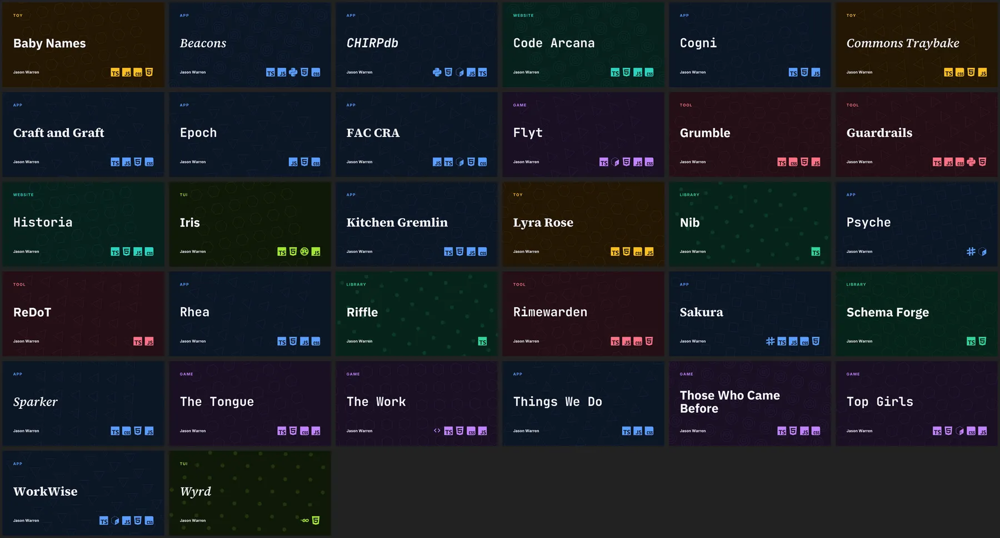

# ADR-003: OG cards are drawn as Atlas survey plates

> **Status**: Proposed
> **Date**: 2026-09-30
> **Author**: Jason Warren
> **Context**: Roadmap task 8DE.1 (Milestone 8, Aesthetics: Ongoing); [`src/lib/og/card.ts`](../../src/lib/og/card.ts); [`docs/design/visual-direction.md`](../design/visual-direction.md); [`docs/design/colour-system.md`](../design/colour-system.md)

---

## Context

`card.ts` renders one 1200×630 PNG per project at build time. Four project dimensions each drive one visual variable: kind picks the background colour, curated language tags pick a row of brand glyphs, runtime picks a tiled background motif and data model picks the name's typeface.

The task framed the problem as the motif. It keys on runtime alone, and 24 of the 32 projects run on Bun (13) or Node (11); three more (Nib, Riffle and Wyrd) have no recognised runtime and fall through to a generic dot. Three avenues were in scope: a wider archetype signal, theme-driven variants and the motif mechanics. Project territories (`themes.ts`) and most of the ignored signal (track, role, relationships) were left out by choice.

Rendering the whole set at share-preview width (about 400px) moved the problem. At 0.13 opacity with a 2.2px stroke the motif is close to invisible, so widening its signal would feed information into a channel nobody sees. Kind colour does all the distinguishing, and 13 of the 32 cards are the same navy "App". Two more findings came from reading the card against the site's own design documents:

- The eight kind colours sit outside the closed ink census (`colour-system.md` §2), which says a new feature wanting colour reuses an existing ink or amends the document. The card did neither.
- The name's face changes with data model, across mono, serif, serif italic and sans. `visual-direction.md` §2 sets every name in Source Serif 4. The eyebrow and footer use Inter, which is not a site face at all.

The card took the Atlas faces in `157ce54`, but used them as a code for data model; the palette stayed as it was before the restyle.

---

## Method

A throwaway fork of the renderer took each variant as a parameter and rendered it across a fixed set of cards chosen to stress the problem: several Bun and Node apps, the no-runtime fallbacks, one card per kind and the default site card. Each round produced one comparison sheet, judged at share size. Seven rounds ran. The fork is kept in [`assets/0003/prototype/`](assets/0003/prototype/) as a starting point for the follow-up tasks; `renderAtlasCard` in `proto.ts` is the round 7 candidate.

| Round | Question                                                             | Sheet                                                   |
| ----- | -------------------------------------------------------------------- | ------------------------------------------------------- |
| 1     | Motif mechanics, compound signal, Atlas light and dark               | [`1-mechanics`](assets/0003/1-mechanics.webp)           |
| 2     | Atlas with a seeded emblem at the summit; Atlas with kind symbology  | [`2-atlas-split`](assets/0003/2-atlas-split.webp)       |
| 3     | Both combined                                                        | [`3-atlas-combined`](assets/0003/3-atlas-combined.webp) |
| 4     | The combination across all 33 cards, with title-aware placement      | [`4-full-set`](assets/0003/4-full-set.webp)             |
| 5     | Typography: Atlas type roles, a mono legend, italic for graph models | [`5-typography`](assets/0003/5-typography.webp)         |
| 6     | Composition, language glyphs and summit ink, one axis per row        | [`6-composition`](assets/0003/6-composition.webp)       |
| 7     | The chosen combination across all 33 cards                           | [`7-candidate`](assets/0003/7-candidate.webp)           |

---

## Decision

### The sheet

Every card is a survey plate on the Atlas light sheet: warm paper, a 100px graticule and a double neatline inset from the edge. The paper and line colours are the resolved values of `--color-surface`, `--color-grid`, `--color-border` and `--color-text` in light mode.

One PNG is served per slug, so the viewer's theme toggle can never reach the card. Light was chosen over lamplit dark: on paper the contour linework held its contrast at share size, and dark contours washed out until they were pushed brighter.

### Typography

Type follows the site's three roles.

| Element   | Face and weight          | Colour      | Content                                                    |
| --------- | ------------------------ | ----------- | ---------------------------------------------------------- |
| Name      | Source Serif 4 600, 96px | text        | Project name, `-0.015em` tracking, wraps at 840px          |
| Legend    | JetBrains Mono 500, 30px | text-subtle | Line 1: runtime · data model. Line 2: up to four languages |
| Eyebrow   | JetBrains Mono 500, 28px | oxide       | Kind label, uppercase, `0.16em` tracking                   |
| Signature | IBM Plex Sans 600, 26px  | text-subtle | "Jason Warren", omitted on the default card                |

The name sits low-left with the legend under it; eyebrow and signature run across the top. The data-model-to-typeface mapping is retired: data model now reads as text in the legend (`graph store`, `relational`, `in-memory`), which a stranger can decode. Inter leaves the card.

### Language glyphs become legend text

The brand-glyph row is removed. In blue the tiles were the loudest thing on the plate; shrunk and greyed they could not be identified. Languages print as the legend's second line, capped at four so the line never wraps.

### Kind is carried by contour symbology

Kind moves from hue to mark class, as the colour doctrine asks. Contours are drawn round a seeded summit, and the kind decides how.

| Kind    | Contour treatment                       |
| ------- | --------------------------------------- |
| app     | Organic hill, one summit                |
| game    | Two summits                             |
| tool    | Faceted: seven-point rings              |
| library | Hachured: short outward ticks           |
| tui     | Square: superellipse rings              |
| toy     | Dotted                                  |
| website | Dashed routes radiating from the summit |
| repo    | No contours; the emblem stands alone    |

The first round of this table used doubled lines for library and two dash patterns for toy and website; none of the three read at share size. Hachures, dots and radiating routes replaced them.

### Runtime is carried by an emblem at the summit

The runtime's cell shape (hexagon for Bun, triangle for Node, square for Go and so on) is drawn as a nested emblem at each summit. Count, growth and twist come from the slug, so two Bun apps no longer match. Deno draws plain concentric circles with a centre dot; its three-ring cell packed into a solid blob when nested. Cards with no recognised runtime get a seeded regular polygon of five, seven, eight or nine sides, so the old fallback's identical dots are gone.

### The emblem is inked by stage

The emblem takes the stage ink, resolved by the same rule as `StageBadge`: released projects draw in the released ink; the rest draw in their progress ink; retired projects take the faded mix of whichever applies. The default card keeps oxide. This brings `progress`, `released` and `retired` onto the card, which the task had left out of scope; it was brought in deliberately, because it is the only summit colouring that carries a meaning the site already teaches.

---

## Rationale

The site already made these decisions. Atlas is the identity; the ink census is closed; names are set in serif and apparatus in sans and mono. A card that ignores all three looks like a different site's card, and the preview is often the first thing of the site a stranger sees.

Moving kind from hue to symbology costs recognition at a glance in a mixed feed. What it buys is a set of 33 cards that read as plates from one atlas, and a card that stops contradicting `colour-system.md`. The contours carry enough difference for the set to stay distinct: every card on the round 7 sheet can be told apart from its neighbours.

Seeded variation stays deterministic. The emblem, the contour harmonics and the summit position all draw from a seeded generator keyed on the slug hash, with no `Math.random` and no dates. Two renders of the same card produced byte-identical PNGs.

---

## Alternatives Considered

### Option 1: Keep the dark kind palette; make the tiling visible

**Description**: The current card with the motif at 0.42 opacity and a 4px stroke, faded away from the title (round 1, row 2).

**Pros**:

- Smallest change; the motif becomes legible

**Cons**:

- Still keyed on runtime, so 24 of 32 cards are hexagons or triangles
- Leaves the palette outside the ink census and the type outside the Atlas roles

**Why rejected**: fixes visibility and nothing else.

### Option 2: A single large emblem on the dark kind palette

**Description**: The tiling replaced by one seeded, nested emblem on the right (round 1, row 3).

**Pros**:

- The strongest per-card silhouette of round 1

**Cons**:

- Same palette and type problems as option 1
- The three no-runtime cards drew identical rings

**Why rejected**: the emblem survives inside the decision; the palette does not.

### Option 3: Compound signal, with data model drawn as links between cells

**Description**: Runtime picks the cell, data model decides how cells connect: edges for graph, ruled rows for relational (round 1, row 4).

**Cons**:

- At share size the links do not register; the row read as option 1 with extra noise

**Why rejected**: invisible at the size that matters. Data model reads as legend text instead.

### Option 4: Lamplit dark Atlas

**Description**: The same plate on the dark sheet.

**Cons**:

- Contours washed out at share size in round 2 and needed pushing to a brighter neutral; after that, dark and light held up about equally, with light slightly crisper

**Why rejected**: light was slightly crisper, and one PNG per slug means only one can be served. The dark treatment stays one parameter away.

### Option 5: Seeded census ink on the emblem

**Description**: Each emblem inked with one of the seven census inks, picked by slug hash (round 6, row 6).

**Cons**:

- The colour means nothing; a blue emblem on one app and a purple one on the next say nothing about either
- Needs an amendment to `colour-system.md`, which forbids a data value owning an ink outside a register

**Why rejected**: the colour has no register to belong to. Stage ink gives similar variety and carries a meaning.

### Option 6: Italic names for graph-model projects

**Description**: Atlas type roles, with graph-model project names in Source Serif italic, echoing the italic territory names on the graph views (round 5, row 4).

**Cons**:

- Brings back a font switch the reader has to decode, one channel smaller

**Why rejected**: the legend says "graph store" outright.

---

## Consequences

### Positive

- The card follows the Atlas colour, type and symbology rules it currently breaks
- Every kind and every runtime renders distinctly, and same-kind, same-runtime cards differ by seed
- Data model and languages become legible text
- `simple-icons` and `@fontsource/inter` have no other consumer and leave the dependency list

### Negative

- Kind is no longer recognisable by colour alone in a mixed feed
- The card needs its own copy of resolved token values, since satori cannot read CSS custom properties; that copy can drift from `tokens.css`
- Placement becomes geometry: the emblem has to avoid the name, the header band and the neatline; the name has to be measured to do it
- The card now changes when a project's stage changes, so a release re-renders its preview

### Neutral

- The default site card keeps oxide and has no contours, since it has no kind or stage
- Territories (`themes.ts`) and the remaining ignored signal (track, role, relationships) were not assessed and stay open for a later spike

---

## Implementation Notes

Requirements the prototype surfaced:

1. **Measure the name.** Character-count estimates collided twice (Kitchen Gremlin, Commons Traybake). The prototype measured advance widths from the Source Serif 4 file with satori's bundled `@shuding/opentype.js`, a transitive dependency; the implementation declares an OpenType parser directly.
2. **Keep-out zones.** Two faults remain on the round 7 sheet: a game card's second summit lands in the band of a wrapped name (Those Who Came Before), and a low emblem crosses the neatline (Flyt). The emblem's radius is bounded by the name's measured extent, the header band and the neatline inset; summits are clamped inside the neatline.
3. **Tokens by derivation.** Resolve the paper, line and ink values from the same Reasonable Colors inputs and `--warmth` mix that `tokens.css` uses, with `culori` (already a dependency). Hold them to `tokens.css` with a parity test. No hand-copied hex.
4. **Determinism under test.** A snapshot test hashes a fixed set of rendered cards, so any change to seeding or layout is visible in review.

Proposed follow-up tasks, for `roadmap-update-tasks` once this ADR is accepted:

| Task  | Description                                                                                                                                                                                |
| ----- | ------------------------------------------------------------------------------------------------------------------------------------------------------------------------------------------ |
| 8DE.2 | Atlas plate foundation: derived token module with parity test; paper, graticule and neatline; plate layout; Atlas type roles and legend; drop the kind palette, Inter and the brand glyphs |
| 8DE.3 | Kind contour symbology and runtime emblems, with the seeded no-runtime polygon, measured names and keep-out zones                                                                          |
| 8DE.4 | Stage ink on the emblem, resolved by the `StageBadge` rule                                                                                                                                 |
| 8DE.5 | Byte-stable snapshot test over a fixed card set                                                                                                                                            |

8DE.3 and 8DE.4 depend on 8DE.2; 8DE.5 can land with 8DE.2 and catch everything after it.

---

## Verification

Render all 33 cards and view them at 400px wide beside `0-baseline.webp`. The decision holds if every card is distinguishable from its neighbours, no emblem touches a name, the header or the neatline; two renders of the set are byte-identical.

The decision was wrong if cards on the new sheet are hard to tell apart in a real feed, where they sit beside other sites' previews rather than each other. Nothing in the repository measures that; it is judged by posting links. The two levers are option 4 and a return of kind hue as the emblem's ink.

---

## Related Decisions

- Supersedes the parked "Generative OG variants per theme" idea, already folded into 8DE.1

---

## References

- [`docs/design/visual-direction.md`](../design/visual-direction.md) §2, the Atlas type roles
- [`docs/design/colour-system.md`](../design/colour-system.md) §1 to §3, the ink census and stage registers
- [`src/lib/components/project/StageBadge.svelte`](../../src/lib/components/project/StageBadge.svelte), the stage ink resolution the emblem reuses
- [`src/lib/og/card.ts`](../../src/lib/og/card.ts), the renderer this decision replaces
