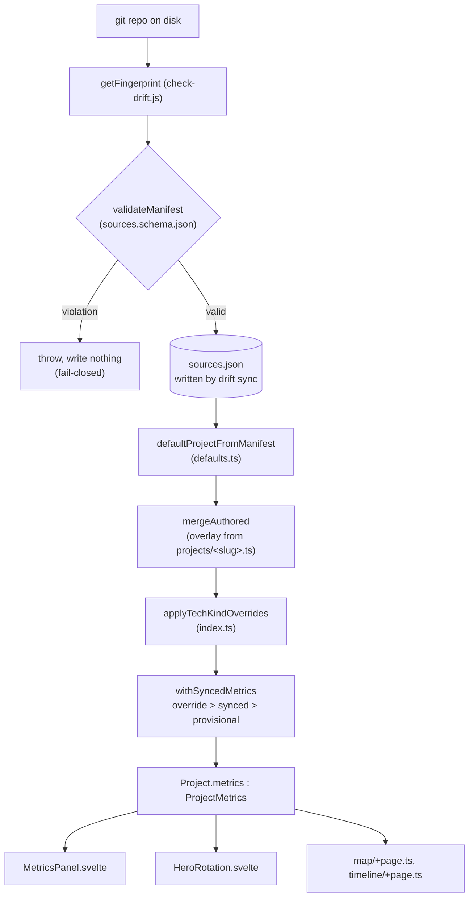

# Drift engine reference (5DR.9)

> Config reference, data model and metric-precedence lifecycle for Drift, the
> CLI engine that fingerprints the git repos behind every project. Companion
> to [`/drift-engine`](/drift-engine) (the narrative version, illustrated for
> site visitors) and [`docs/drift-authoring.md`](./drift-authoring.md) (the
> per-field guide for authoring content). This doc composes above both: it
> answers "how does the system work", not "which field do I type" (that's
> `drift-authoring.md`) and not "walk me through it with pictures" (that's
> `/drift-engine`).

## Contents

- [Start here](#start-here)
- [Config reference](#config-reference)
- [Fresh-machine bootstrap](#fresh-machine-bootstrap)
- [Data model](#data-model)
- [Metric-precedence lifecycle](#metric-precedence-lifecycle)
- [Known issues in adjacent surfaces](#known-issues-in-adjacent-surfaces)

---

## Start here

| I want to...                                         | Go to                                                       |
| ---------------------------------------------------- | ----------------------------------------------------------- |
| Set up Drift on a new machine                        | [Fresh-machine bootstrap](#fresh-machine-bootstrap)         |
| Know what a config key does or where it's read       | [Config reference](#config-reference)                       |
| Understand the shape of the data (types, not fields) | [Data model](#data-model)                                   |
| Trace how a metric gets from git to the page         | [Metric-precedence lifecycle](#metric-precedence-lifecycle) |
| Author a specific field                              | [`drift-authoring.md`](./drift-authoring.md)                |
| See it illustrated                                   | [`/drift-engine`](/drift-engine)                            |

---

## Config reference

Drift's config has four sources, not fully in agreement. `scripts/drift-config.js`
is authoritative: it holds `DEFAULTS`, the `DriftUserConfig`/`DriftResolvedConfig`
JSDoc typedefs, and the resolution order. `drift.config.example.ts` is the
committed template a developer copies to `drift.config.ts` (gitignored,
per-machine). `buildDriftConfigSource` in `check-drift.js` is what `drift init`
actually generates, a narrower surface than either of the other two. Document
the first two as canonical; never the personal file's contents.

**Resolution order** (`loadConfig` in `drift-config.js`): `DRIFT_CONFIG` env
variable (absolute, or resolved from the repo root if relative) → `<repoRoot>/
drift.config.ts` → built-in `DEFAULTS`. Any import or parse failure emits one
stderr warning and falls back to defaults; `loadConfig` never throws. Merge is
shallow, with one explicit nested level for `author`, `theme`, and `files`:
arrays like `excludedRepoNames` are replaced wholesale, not merged.

### Every key

| Key                   | Shape                          | Default                         | Controls                                                                                                                 | Consumed at                                                      |
| --------------------- | ------------------------------ | ------------------------------- | ------------------------------------------------------------------------------------------------------------------------ | ---------------------------------------------------------------- |
| `dataDir`             | `string`                       | `'src/lib/data'`                | Base directory all data-file paths resolve from                                                                          | Indirectly, via `config.paths.*`                                 |
| `files`               | `Record<string,string>`        | `{}`                            | Per-file path override, keyed by logical name (below)                                                                    | `resolveDataPath` in `drift-config.js`, feeding `config.paths.*` |
| `scanRoot`            | `string`                       | `~/Code`                        | Root directory scanned for un-tracked git repos                                                                          | `check-drift.js` (`const codeRoot = config.scanRoot`)            |
| `scanDepth`           | `number`                       | `3`                             | Max recursion depth for that scan                                                                                        | `check-drift.js` (`if (depth > config.scanDepth) return`)        |
| `author.pattern`      | `string` (ERE alternation)     | Jason's git identities          | `--author` flag for "by me" commit/churn queries; a miss degrades to 0, never errors                                     | `check-drift.js` → `AUTHOR_PATTERN`                              |
| `author.recentWindow` | `string` (git `--since` value) | `'4 weeks ago'`                 | Trailing window for `*Recent` metrics                                                                                    | `check-drift.js` → `RECENT_WINDOW`                               |
| `author.botPattern`   | `string` (ERE alternation)     | Jason's bot/AI-agent identities | Non-human authors removed from the all-authors commit **denominator only** (churn/LOC still count every commit)          | `check-drift.js` → `BOT_PATTERN`                                 |
| `excludedRepoNames`   | `string[]`                     | 18 portfolio-specific names     | Folder names gated out of the directory scan, before a slug exists; checked against the raw name and its kebab-case form | `check-drift.js`, unioned with legacy `excluded.json.repoNames`  |
| `theme.primary`       | hex string                     | `'#3E7F96'`                     | gum cursor/selection/border colour                                                                                       | `check-drift.js` → `BRAND_PRIMARY`                               |
| `theme.accent`        | hex string                     | `'#B34480'`                     | gum item foreground, wordmark text                                                                                       | `check-drift.js` → `BRAND_ACCENT`                                |
| `theme.markdownTheme` | string                         | `'pink'`                        | `gum format --theme <value>`                                                                                             | six call sites in `check-drift.js`                               |

**`config.paths`**: the eight absolute paths `buildConfig` resolves from `files`
(each logical name falls back to `dataDirAbs/<default>` when unset):

| Logical name | Default filename         | `check-drift.js` binding |
| ------------ | ------------------------ | ------------------------ |
| `sources`    | `sources.json`           | `sourcesPath`            |
| `topology`   | `source-topology.json`   | `topologyPath`           |
| `local`      | `sources.local.json`     | `localPath`              |
| `overrides`  | `overrides.json`         | `overridesPath`          |
| `excluded`   | `excluded.json`          | `excludedPath`           |
| `cache`      | `.drift-cache.json`      | `cachePath`              |
| `projects`   | `projects` (a directory) | `projectsDir`            |
| `inProgress` | `in-progress.json`       | `inProgressPath`         |

**Not config-backed**: `tech-relationships.ts`, `tech-overlays.ts`, `themes.ts`
are derived as siblings of `dirname(projectsDir)` in `check-drift.js` rather
than having their own `files` entries. A real config gap, noted here rather
than proposed as a fix.

### What `drift init` scaffolds vs. the full surface

`drift init` (`runInit`, calling `buildDriftConfigSource`) writes `dataDir`,
`scanRoot`, `scanDepth`, `author.pattern`, `author.recentWindow`,
`excludedRepoNames`, and `theme.*`, but omits `files` and, more importantly,
**`author.botPattern`**.

`files`'s omission is harmless: `buildConfig` shallow-merges any hand-added
`files` entry over `DEFAULTS.files` regardless of whether `drift init` prompted
for it, so nothing is lost by adding one later.

`author.botPattern`'s omission is not the same kind of gap. Its default in
`DEFAULTS` is not a neutral placeholder, it's Jason's own bot/AI-agent identity
pattern. A fresh `drift init` on someone else's machine silently inherits that
default rather than a sensible one, and nothing in the scaffolded file hints
that the field exists to override. Documented here, not fixed here: see
[Known issues](#known-issues-in-adjacent-surfaces) and roadmap task `5DR.26`.

---

## Fresh-machine bootstrap

1. (Optional) Install [`gum`](https://github.com/charmbracelet/gum) for the
   interactive menu and coloured output. Every verb works without it.
2. Run `drift init`. It scaffolds `drift.config.ts` and
   `src/lib/data/sources.local.json`, prompting for values when `gum` and an
   interactive terminal are available, writing built-in defaults silently
   otherwise. Never overwrites an existing file.
3. Fill in `sources.local.json` with the absolute path to each source repo on
   this machine.
4. Run `drift sync` to fingerprint every repo and write `sources.json`.
5. Run `drift` (bare) to see the report, or `drift snapshot` for the full
   current state of every metric.

`author.botPattern` is not scaffolded by step 2; see the config reference
above. Add it to `drift.config.ts` by hand if this machine's commit history
includes bot or AI-agent authors you want excluded from the all-authors count.

---

## Data model

20 exported types in `src/lib/data/types.ts`, composing into four top-level
shapes. This section answers "what are the shapes and how do they compose";
for the full per-field table, see `docs/design/property-census.md`
(type-oriented) or `docs/drift-authoring.md` (authoring-action-oriented).

### The four top-level shapes

**`SyncedSource`**: everything `drift sync` measures for one repo. 32 fields:
a commit grid (4, all surfaced), 6 inference-only inputs that never reach
`Project` (consumed only inside `defaults.ts`), 2 dates, 3 span-shape fields
(measured but not yet surfaced anywhere), codebase size, an 8-field churn
grid, and repo identity / dependency-detection fields. Canonical contract:
`scripts/sources.schema.json`.

**`SyncedMetricKey`**: the 13-member string union deciding which
`SyncedSource` fields reach the site as metrics. The single place that
decides portfolio-facing status; everything absent from it is either
inference-only or measured-not-surfaced.

**`ProjectMetrics`**: `extends Pick<SyncedSource, SyncedMetricKey>`, plus two
gate-produced fields, `commitsHeadline` and `commitsHeadlineScope`, populated
only by the curation gate inside `withSyncedMetrics`, never authored. The
`Pick` is the anti-drift device: the synced half can't fall out of step with
`SyncedSource` because it's derived, not restated.

**`AuthoredProject`**: every field a human can write in an overlay. All
optional except `slug`. Dates and metrics are deliberately absent, so an
overlay can never carry a stale copy of a derived value. See
`drift-authoring.md` for the full per-field table.

**`Project`**: the merged output every Svelte component renders. Composes
the above via `defaultProjectFromManifest` → `mergeAuthored` →
`applyTechKindOverrides` → `withSyncedMetrics` (traced in full below).

### Nested and adjacent types

`TagKind`, `EdgeCategory`, `TechTag` (tag identity); `ProjectRole`,
`ProjectTrack`, `ProjectProgress`, `ProjectKind` (project-level enums);
`RelationshipKind`, `ProjectRelationship` (project-to-project edges);
`LineageKind`, `TechRelationship` (tech-to-tech edges, in
`tech-relationships.ts`, standalone from `types.ts`); `TechSurface`,
`TechOverlay` (per-tech overrides, in `tech-overlays.ts`); `Collaboration`,
`Contribution`, `AuthoredContribution` (the role/team discriminated union);
`ProjectSlug` (a plain string, see below); `TrackedField`, `InProgressEntry`
(the provisional-metrics shape). `Theme` lives in `themes.ts`, not `types.ts`.

`FieldOverride<T>` and `SlugOverrides` (the `overrides.json` entry shape) are
**not** in `types.ts`: they're local to `index.ts`, unexported.

### ProjectSlug: why it's a plain string

`ProjectSlug` was a hand-maintained string-literal union, giving compile-time
cross-link safety. It's now `type ProjectSlug = string`, because manifest
slugs are discovered dynamically via `import.meta.glob` and can't be
enumerated in a closed union. Safety is preserved at build time by two other
mechanisms instead: `themes.ts` throws during prerender on a dangling
relationship target, and a `data.test.ts` assertion fails the build on a
typo'd target before prerender runs. What's lost is editor autocomplete on
slug literals; what's kept is build-time failure on the actual mistake.

---

## Metric-precedence lifecycle

The one rule: **override > synced > provisional**, applied per field inside
`withSyncedMetrics`. Overlays carry no metrics or dates by design, so there is
no authored tier: this is stated as fact repeatedly across the codebase
(`withSyncedMetrics` itself, `AuthoredProject`'s doc-comment, and
`/drift-engine`'s own `precedenceSnippet`), and it's worth stating plainly
here too, since two other documents in this repo have gotten it wrong at one
point or another (see [Known issues](#known-issues-in-adjacent-surfaces)).

### From git repo to rendered page



Every step above names a real call site: `getFingerprint` in `check-drift.js`,
`validateManifest` and the fail-closed throw beside it, `defaultProjectFromManifest`
and `mergeAuthored` in `defaults.ts`, `applyTechKindOverrides` and
`withSyncedMetrics` in `index.ts`.

Inside `withSyncedMetrics`, per field:

```
merged.<field> = override?.<field>?.value
               ?? synced?.<field>
               ?? provisional?.tracked?.<field>?.value
```

Two things happen alongside the plain merge: the **curation gate** picks
`commitsHeadline`/`commitsHeadlineScope` (solo → `commitsAny`, scope `'any'`;
team → `commitsMe`, scope `'me'`, overridable outright), and every `undefined`
key is deleted from the merged object rather than left as an explicit
`undefined`. `commitsHeadlineScope` is deleted whenever `commitsHeadline` is
absent, so a scope never outlives its headline.

For the illustrated version of this exact chain, see `/drift-engine`'s
"Staging" stage.

### The override sub-lifecycle

An override entry is always **hand-written** into `overrides.json`; no verb
creates one. Its shape: `{ value, syncedWhenSet, syncedField?, _setNote? }`.
`syncedWhenSet: null` marks a pure pin with no baseline; it's never flagged.

```
1. Hand-write overrides.json[slug][field] = { value, syncedWhenSet, ... }
2. withSyncedMetrics puts it at the head of the precedence chain: it wins.
3. Every drift report re-checks: is overrides[slug][field].syncedWhenSet
   still equal to the CURRENT synced value?
4. On mismatch, the report prints (verbatim, check-drift.js):

   {slug}.{field}: you set {value} when synced was {was}; synced is now
   {now} (run `drift keep {slug} {field}` to keep your value and dismiss)

5. `drift keep <slug> <field>` refreshes syncedWhenSet to the current
   synced value. Your pinned `value` is untouched. The flag clears, until
   synced moves again.
```

`drift keep --all-projects <field>` repeats step 5 for one named field
across every flagged project; `drift keep-all` repeats it for every flagged
field on every project.

### The third tier: provisional

`in-progress.json` holds metrics for work still on an unmerged branch, one
entry per slug, gated by `visibility: 'public' | 'local'`: only `'public'`
entries reach `withSyncedMetrics`'s `provisional` lookup at all. Once the
branch lands and `drift sync` runs, the real synced value naturally
out-ranks the provisional one under the precedence rule above: promotion is
self-healing, no stale figure leaks through. `drift promote <slug>` then
removes the now-redundant entry; it doesn't make the real number show, it's
tidying.

---

## Known issues in adjacent surfaces

Line numbers below are the one exception to this repo's usual citation rule
(file plus symbol); they locate a specific fix. Confirmed at commit time,
not guaranteed to stay current: re-grep the symbol if a line has moved.

| Location                                                                     | Issue                                                                                                                                                                                                                                                | Status                                                                                                    |
| ---------------------------------------------------------------------------- | ---------------------------------------------------------------------------------------------------------------------------------------------------------------------------------------------------------------------------------------------------- | --------------------------------------------------------------------------------------------------------- |
| `docs/drift-boundary.md` (verb names, field renames, data-flow diagram)      | Named retired verbs (`drift update`/`accept`/`exclude`/`pin`) and pre-rename field names throughout; missing `in-progress.json` from its data-flow diagram                                                                                           | **Fixed** alongside this doc                                                                              |
| `src/lib/data/index.ts` (header comment)                                     | Same retired-verb naming, plus a false "nothing auto-writes `projects/*.ts`" claim (four verbs do write it, none rewrites content wholesale)                                                                                                         | **Fixed** alongside this doc                                                                              |
| `src/routes/drift-engine/+page.svelte` ("Staging" stage widget)              | Drew four precedence tiers (added a phantom `authored` tier) against its own prose stating three                                                                                                                                                     | **Fixed** alongside this doc                                                                              |
| `src/lib/components/project/MetricsPanel.svelte` (`linesAny` label)          | Labelled a line count "Source files"                                                                                                                                                                                                                 | **Fixed** alongside this doc                                                                              |
| `src/routes/drift-engine/+page.ts` (`slugSnippet`)                           | A hand-copied `ProjectRelationship` definition inside a template literal, displayed as source. Currently accurate, but the divergence risk the property census originally flagged is still live: nothing enforces it staying in sync with `types.ts` | **Not fixed**: accurate today, standing risk, out of scope here                                           |
| `docs/drift-improvement-plan.md:23`                                          | States precedence as `override.value ?? synced ?? authored`; there is no authored tier                                                                                                                                                               | **Flagged, not fixed**: historical planning document, superseded by this doc                              |
| `docs/drift-improvement-plan.md`, Phase 6 status                             | Marked ⬜ "not yet built" for the staging pipeline (`in-progress.json`), which has since shipped                                                                                                                                                     | **Flagged, not fixed**: same historical-document reasoning                                                |
| `drift.config.example.ts` (`files` list, `drift init` claim)                 | Listed 6 of 8 `files` logical names; claimed to be the exact shape `drift init` generates                                                                                                                                                            | **Fixed** alongside this doc                                                                              |
| `types.ts` (top-of-file comment, `SYNCED_METRIC_KEYS`)                       | Claimed `ProjectSlug` is a union (it's a plain string); cited a symbol, `SYNCED_METRIC_KEYS`, that doesn't exist                                                                                                                                     | **Fixed** alongside this doc                                                                              |
| `drift init` (`buildDriftConfigSource`) doesn't scaffold `author.botPattern` | A fresh checkout silently inherits Jason's personal bot/AI-agent identity pattern as the default                                                                                                                                                     | **Documented, not fixed**: needs a design decision on the right default; tracked as roadmap task `5DR.26` |
