# Portfolio MVP Roadmap

The site is live and substantially built: full routes, the graph/timeline/map/toolkit views, 30+ typed projects and the Drift CLI. This phase deepens the site as an artefact and decouples Drift's engine from its portfolio-specific couplings. Content (M1), features (M2), design (M3) and Drift's tests-and-docs (M6) are done, and the Drift engine work (M5) is complete bar two follow-up verbs; quality (M4), total data control from the CLI menu (M7), ongoing aesthetics (M8), extraction (M10), the project lifecycle chain (M11) and packaging (M12) remain.

**Critical path:** on the site side `4QU.5 → 4QU.1 → 4QU.3` still gates M4. On the Drift side the urgent run is `11LC.2 → 11LC.3`: `drift register` then sync admission, both standing outside the resolver so they can ship first, because the assumption that `drift report --full` registered repos was never true. The longest run is `11LC.1 → 11LC.12 → 11LC.13 → 11LC.10`: the lifecycle resolver, the missing-path split, relocate and unregister, then M11's sink, the scripted acceptance of its five scenarios. M7's browse, act-in-context and config work now waits on M11's card view, field editing, list and approve verbs.

---

## Milestone 1 — Content Depth & Polish

**Goal:** Make the written substance match the engineering: every entry flagship-ready, the connective copy carrying voice and intent.

- [x] **1CO.1** — Audit every project entry for depth; output in docs/audits/content-depth.md
- [x] **1CO.2** — Bring every project entry to flagship-ready depth (worklist in docs/audits/content-depth.md) _(depends on 1CO.1)_
- [x] **1CO.3** — Strengthen contributionNote copy across all team projects
- [x] **1CO.4** — Rewrite About page narrative (positioning, voice)
- [x] **1CO.5** — Expand the Colophon into the drift-engine deep-dive: the build, the data model and the Drift tooling story _(depends on M5)_
- [x] **1CO.6** — Review theme groupings and theme copy for coherence _(depends on 1CO.1)_
- [x] **1CO.7** — Review engine-extraction thread narratives for clarity _(depends on 1CO.4)_
- [x] **1CO.8** — Pass all copy through the writing-style guide (British spelling, voice) _(depends on 1CO.2, 1CO.3, 1CO.7, 1CO.9)_
- [x] **1CO.9** — CV / hire-me positioning copy on a new /hire route _(depends on 1CO.4)_
- [x] **1CO.10** — Surfaced-project rotation: fully derived hero scoring and map hub selection _(depends on 1CO.2)_

---

## Milestone 2 — Exploration & New Features

**Goal:** Give visitors more ways into the work: search, deep-linkable selections, multi-select filters, polished interactions and a tech-stack constellation.

- [x] **2FE.1** — Client-side search across projects (title, tags, description)
- [x] **2FE.2** — Deep-link map / timeline / toolkit selections via shared URL params
- [x] **2FE.3** — Polish existing interactions: keyboard and ARIA parity, shared dim tokens, cross-view link fixes
- [x] **2FE.4** — Multi-select filters: OR within a dimension, AND across dimensions
- [x] **2FE.5** — Cross-view continuity: shared pin helpers and view-to-view links _(depends on 2FE.2)_
- [x] **2FE.6** — Tech-stack constellation visualisation (technologies mode on the map)
- [x] **2FE.7** — Technology lineage edges (leads-to / replaced-by) on the map and adoption chart
- [x] **2FE.8** — Robust filter-toggle relayout: deterministic best-of-N reheat

---

## Milestone 3 — Design & Interaction Polish

**Goal:** Give the site a distinct visual identity, settling a design direction first so every polish task flows from it.

- [x] **3DE.0** — Define visual direction / signature: mood, type pairing, motion language, graph styling principles
- [x] **3DE.1** — Typography pass (scale, rhythm, measure) across all routes _(depends on 3DE.0)_
- [x] **3DE.2** — Responsive audit: map / timeline / grids on small viewports _(depends on 3DE.3, 3DE.4)_
- [x] **3DE.3** — Motion pass: meaningful transitions, respect prefers-reduced-motion _(depends on 3DE.1)_
- [x] **3DE.4** — Refine graph aesthetics (edge styling, clustering legibility, constellation view) _(depends on 3DE.5, 3DE.6)_
- [x] **3DE.5** — Consistency sweep of semantic colour aliases vs Reasonable Colors usage _(depends on 3DE.0)_
- [x] **3DE.6** — Drastically improve the /map graph layout for legibility _(depends on 3DE.0)_

---

## Milestone 4 — Quality & Reach

**Goal:** Make the site accessible, discoverable and well-tested; the quality bar is itself part of the exhibit.

- [ ] **4QU.1** — Accessibility audit: keyboard nav, ARIA, contrast, SVG view semantics _(blocked — depends on 4QU.5)_
- [ ] **4QU.3** — SEO pass: structured data, meta completeness, sitemap; light perf sanity-check _(blocked — depends on 4QU.1)_
- [x] **4QU.4** — Confirm OG image coverage for every route and project
- [ ] **4QU.5** — Component / interaction test coverage for the connection views _(depends on M3)_
- [ ] **4QU.7** — a11y regression pass on the tech-stack constellation _(blocked — depends on 4QU.1)_
- [x] **4QU.8** — Analyse and reconcile where the map's Technologies mode and the Toolkit get their data: overlapping tech vocabularies from different sources should agree

---

## Milestone 5 — Drift Decoupling: Engine & Verbs

**Goal:** Break Drift's six portfolio couplings into a config-driven design: a framework-agnostic core engine beside a Svelte integration layer.

- [x] **5DR.0** — Drift CLI foundation: dispatcher, fingerprinting, cache, manifest registry, core verbs
- [x] **5DR.1** — Boundary doc: the core-engine vs Svelte-integration contract _(depends on 5DR.0)_
- [x] **5DR.2** — Coupling inventory: annotate the six couplings in check-drift.js _(depends on 5DR.12)_
- [x] **5DR.3** — Config layer: paths, author pattern, scan root, excludes, gum theme _(depends on 5DR.1, 5DR.2)_
- [x] **5DR.4** — Relocate the tag taxonomy to the engine boundary _(depends on 5DR.3)_
- [x] **5DR.5** — Define the engine's public data schema (the sources.schema.json contract) _(depends on 5DR.1)_
- [x] **5DR.6** — Split the core engine from the Svelte integration _(depends on 5DR.4, 5DR.14)_
- [x] **5DR.7** — Branch awareness plus the in-progress.json staging pipeline _(depends on 5DR.6)_
- [x] **5DR.11** — drift audit verb: mechanical-proxy tier scoring across authored overlays _(depends on 5DR.5, 5DR.6)_
- [x] **5DR.12** — Migrate the repo package manager from npm to Bun
- [x] **5DR.13** — drift init scaffold verb _(depends on 5DR.7)_
- [x] **5DR.14** — Rename Drift verbs for clearer intent (update to sync, accept to keep, exclude to hide) _(depends on 5DR.0)_
- [x] **5DR.15** — drift author verb: scaffold and open a project overlay _(depends on 5DR.6)_
- [x] **5DR.16** — drift pin verb: set pin in a project overlay _(depends on 5DR.6)_
- [x] **5DR.17** — drift flag verb: the pin and hide overlay flags under one verb _(depends on 5DR.16)_
- [x] **5DR.18** — drift relate verb: write a ProjectRelationship into a project overlay
- [x] **5DR.19** — drift link verb: write a TechRelationship into tech-relationships.ts _(depends on 5DR.6)_
- [x] **5DR.20** — Intra-span dormancy signal: sample commit dates so activity gaps become detectable _(depends on 5DR.7)_
- [x] **5DR.21** — Improve role detection: richer signals than commit share for the solo/lead/collaborator inference _(depends on 5DR.6)_
- [x] **5DR.22** — drift enrich verb: opt-in gh-backed enrichment writing GitHub's own archived repo flag and homepageUrl into a schema-extended sources.json section, while drift sync stays offline
- [x] **5DR.28** — Parallelise the per-repo `gh repo view` calls in drift enrich (currently sequential via fetchGhRepoView)
  - Note: Raised as a deliberately out-of-scope follow-up during PR 45 review. Both ways out named in review were sequential; concurrency is a larger change than that PR's fix warranted.
- [x] **5DR.24** — Audit the Project property surface: no two fields claim the same fact, and every fact worth storing has exactly one home
  - Note: Covers SyncedSource, AuthoredProject, Project, ProjectMetrics and the nested Contribution/TechTag/ProjectRelationship shapes. Overlap precedent: deployed is derived from liveUrl presence; progress and released were split because one field made two claims; retired and hide both carried the hero-pool exclusion. Coverage gap already known: spanMonthsActive, spanMonthsAll and spanGapMaxDays are synced but reach no Project field (resolved by 5DR.25).
- [x] **5DR.25** — Surface the intra-span activity metrics (spanMonthsActive, spanMonthsAll, spanGapMaxDays) so the sustained-vs-bursty signal reaches the site _(depends on 5DR.24)_
  - Note: Finding F6 of the property census (docs/design/property-census.md), now FIXED. All three were measured by check-drift.js on every sync and persisted for all 33 repos, but nothing in src/ read them. Added to SyncedMetricKey and the withSyncedMetrics gate; ProjectMetrics picked them up via the Pick derived from F4's fix, no second declaration needed. Deliberately data-layer only: these are visualisation inputs (the timeline's rail currently renders regardless of how work was distributed across a project's span), not a MetricsPanel row: the active/total ratio is confounded by project age, so a displayed percentage was rejected in favour of raw counts reaching Project.metrics for chart consumers to draw honestly (span as an axis, not a score). Presentation work is a follow-up task.
- [x] **5DR.26** — drift init doesn't scaffold author.botPattern, so a fresh config silently inherits Jason's personal AI-agent bot pattern as the default _(depends on 5DR.3, 5DR.13)_
  - Note: Fixed. drift init now scaffolds author.botPattern with a generic default (\[bot\]|github-actions), narrowed from Jason's personal AI-agent identity pattern in DEFAULTS (scripts/drift-config.js). A comment in the scaffolded config shows how to extend it with AI-agent identities. Design decision: empty string was ruled out (an empty botPattern silently zeroes commitsHuman/authorsDistinctHuman via an always-failing PCRE negative lookahead, verified against this repo's own history). DEFAULTS was narrowed to match (breaking change, v8.0.0) since Jason's own drift.config.ts sets botPattern explicitly and is unaffected.
- [x] **5DR.30** — drift CLI: filtered "new repos only" verb (e.g. `drift new` or `--new-only`) that reports newly-discovered repos under scanRoot without the full drift/conflict report
- [x] **5DR.31**: Adoption history is append-only in the engine: drift sync keeps a detectedTechFirstSeen entry for an identity that leaves detection and records lastSeen, so a major migration retires the old identity instead of erasing it
  - Note: code-arcana's Svelte 4 to 5 migration in the 2026-09-17 sync dropped svelte-4 from detectedFramework and from detectedTechFirstSeen (sources.json, code-arcana), leaving no synced record it was ever used, even though check-drift.js:811 dates that exact migration with a per-major regex pickaxe. detectedTechFirstSeen is already skipped by the drift comparison (DRIFT_SKIP_FIELDS, check-drift.js:247), so a ratchet there adds no drift noise. Shape: keep the firstSeen date, add lastSeen (the commit that removed the identity, from the same pickaxe run in reverse, or the sync date as a fallback) and extend sources.schema.json (5DR.5) to match. Present-tense fields (detectedFramework et al.) stay as they are; only the history object ratchets.
- [ ] **5DR.32**: Tech universe for lineage and the timeline is present tags plus retired history: tech overlays may declare labels no project carries, with firstUsed and lastUsed; the timeline renders retired tech with an end date; the lineage tests removed in 780a817 return against the union _(depends on 5DR.31)_
  - Note: Lineage edges are statements about history (replaced-by Svelte 4 to Svelte 5, tech-relationships.ts:87), yet tech-relationships.test.ts validated every endpoint against the tags projects carry today, so the edge became invalid the moment the migration it describes happened. Three tests were removed in 780a817 rather than left red: every source and target is a real tag label, every edge resolves on at least one surface, and surface-vocabulary's dropped-map-edge check. Reinstate them against the union of present tags, ratcheted history (5DR.31) and overlay-declared historical labels, with a retired endpoint as a second legitimate reason for a map edge to drop. Present-tense surfaces (toolkit, stack, constellation) keep reading project tags only; hiddenFrom already exists for keeping a label off them. The Svelte 4 firstUsed floor (tech-overlays.ts:35, 2024-11-01) predates every synced date and becomes the first overlay to gain a lastUsed.
  - Note: New-repo discovery already exists inside the default `drift report`/`--check` path (check-drift.js:2068-2105, 2193, 3190, 7263); this exposes that subset as its own filtered output rather than building discovery from scratch.

---

## Milestone 6 — Drift: Tests & Docs

**Goal:** Once the engine is stable, lock it down with a test suite and document it for future maintainers.

- [x] **5DR.8** — Engine test suite: config resolution, fingerprinting, drift computation
- [x] **5DR.9** — Drift docs: config reference, data model, metric-precedence lifecycle diagram
- [x] **5DR.10** — Authoring guide: which fields Drift populates vs hand-authored, and where overrides live

---

## Milestone 7 — Drift: Total Data Control

**Goal:** A drift portfolio's entire data state can be seen, controlled and manipulated through the drift CLI menu.

- [ ] **7DR.1** — Per-field provenance resolver: value, origin (synced / inferred / authored / overridden), and the inference an authored value agrees or disagrees with _(depends on 5DR.6, 5DR.24)_
  - Note: Provenance is currently spread across sources.json, overrides.json, the project overlay and defaults.ts. One resolver so the detail views and the redundancy report (7DR.11) read the same answer; the redundancy tests that used to live in data.test.ts were removed in 780a817 because they asserted content state and went red on every sync.
- [ ] **7DR.2** — Project detail view: every field for one project on a single screen, each with its provenance _(blocked: depends on 7DR.1, 11LC.7)_
- [ ] **7DR.3** — Tech, tag and theme detail views on the same pattern as the project view _(blocked — depends on 7DR.1)_
- [ ] **7DR.4** — Act in context: invoke the relevant verbs from a detail view without re-picking the target _(blocked: depends on 7DR.2, 7DR.3, 10EX.1, 11LC.8)_
  - Note: The menu is verb-first (pick a verb, then a target). This inverts it for the browse path; the verb-first sections stay for anyone who already knows what they want. Gated on 10EX.1 because that spike settles the extraction shape for the portfolio-shaped verbs this task grows, and on 11LC.8 because acting in context needs a verb behind every card-visible field. Resolved by ADR-001: the overlay verbs are Engine verbs, so new ones this task grows are Engine code.
- [ ] **7DR.5** — Reach audit: confirm every field in every data file has a menu path, and fill the gaps _(blocked: depends on 5DR.24, 7DR.4, 11LC.2)_
  - Note: Only meaningful once 5DR.24 has settled the field set and 7DR.4's detail-view menu paths exist to audit. Covers all eight configured data paths: sources, topology, local, overrides, excluded, cache, projects, in-progress.
- [ ] **7DR.6** — Search across projects, tech, tags and themes from one entry point _(blocked — depends on 7DR.2, 7DR.3)_
- [ ] **7DR.7** — Filter and sort the browse lists (drift state, track, role, tier, kind) _(blocked: depends on 7DR.2, 7DR.3, 11LC.4)_
- [ ] **7DR.8** — Multi-select and bulk apply across a filtered set _(blocked — depends on 7DR.7)_
  - Note: Bulk writes are how redundant authored values get mass-produced, which the data.test.ts redundancy checks reject. A bulk write must surface which targets would gain a value matching the inference before it applies.
- [ ] **7DR.9**: drift config verb: show every effective engine setting with its source (built-in default, drift.config.ts, DRIFT*CONFIG, committed policy) and set one from the CLI, so defaults are viewable and editable without opening a file *(blocked: depends on 7DR.10)\_
  - Note: Resolution order is DRIFT_CONFIG env, then <repoRoot>/drift.config.ts, then DEFAULTS in scripts/drift-config.js (docs/drift/02-cli.md, Configuration); nothing today prints the merged result, so a user cannot tell which layer a value came from. Writing a key uses the TypeScript-compiler splice the overlay verbs already use (the config is a .ts module), the route 11LC.6 takes for excludedRepoNames; a committed policy key (7DR.10) is a JSON write instead. Examples the user named: auto-publication and whether archived repos are hidden, both of which 7DR.10 introduces, which is why this waits on it rather than shipping with only paths and the gum theme to show.
- [ ] **7DR.10**: Policy defaults with a committed home: publishOnSync (when false the registry admits only approved or authored slugs) and hideArchived (an enriched archived flag removes the repo from the site), each with a documented default _(blocked: depends on 11LC.11, 5DR.23)_
  - Note: Two policy switches the lifecycle work makes meaningful. publishOnSync defaults to true (today's behaviour: every non-excluded manifest slug is on the site, index.ts:313); false turns drift approve (11LC.11) into a publication gate by filtering the registry to approved-or-authored slugs, which is why this waits on the approve verb. hideArchived reads the enriched section's archived flag (5DR.22) and waits on 5DR.23, which decides how archived reaches the site's retired axis; the switch chooses between shading (retired) and removal (hidden). First decision of the task: drift.config.ts is gitignored and per-machine (.gitignore:30), so a policy that changes what the site renders cannot live there or the Vercel build would silently fall back to the default. Policy needs a committed home both the CLI and index.ts read (a drift.policy.json beside sources.json, or a policy section in an existing committed data file), distinct from machine config.
- [ ] **7DR.11**: Redundancy report: surface authored values that match the current inference (track, contribution.role) as a drift report warning with a one-step delete, replacing the test-suite assertion _(blocked: depends on 7DR.1)_
  - Note: Two assertions in data.test.ts (removed in 780a817) failed CI whenever a sync moved inferTrack or the role heuristic onto an authored value; three repos crossing the product line-count threshold did exactly that. Agreement between an authored value and a heuristic is content state, not a code invariant, so it belongs in report output: cogni.track = product matches the inference, delete to render as provisional or keep to pin it. 7DR.1's resolver is what answers agrees or disagrees per field, so this waits on it; the resolver's own tests cover the logic against fixtures rather than the live manifest. Keep the rationale the tests carried: trackAuthored drives the dotted-provisional convention, so a redundant authored value silently upgrades a guess into a claim.

---

## Milestone 8 — Aesthetics: Ongoing

**Goal:** The standing home for aesthetic work after the visual direction settled in M3: refinements to how the site and its generated artefacts look, taken up once the functional milestones they depend on have landed.

- [ ] **8DE.1** — Spike: investigate enhancements to the procedural OG card generation, and record the options with a recommendation
  - Note: Supersedes the parked "Generative OG variants per theme" idea, which was one avenue among several. src/lib/og/card.ts derives each card from project data, but keys its motif on runtime alone via runtimeArchetype(), so 23 of 33 projects collapse into two archetypes (bun 12, node 11) and 5 fall through to the generic dot. Avenues to weigh: widening the archetype signal beyond runtime; theme-driven variants (themes currently feed nothing in card.ts); using signal the card already receives and ignores (kind, track, role, tags, lineage); and the motif mechanics themselves (one fixed 132px tiling, hash-seeded rotation and phase). Output is a written comparison with a recommendation, not an implementation; follow-up tasks land after it is read.
- [ ] **5DR.23** — Derive the site's retired and deployed axes from enriched manifest data, replacing the authored placeholders _(depends on 5DR.22)_
- [ ] **5DR.27** — Use the intra-span activity metrics in the timeline and/or graph visuals so a sparse multi-year project no longer renders identically to one sustained continuously _(depends on 5DR.25)_
  - Note: spanMonthsActive, spanMonthsAll and spanGapMaxDays reached Project.metrics via 5DR.25 as raw counts, deliberately without a display rule. The timeline's rail currently runs solid from commitAnyRoot to commitAnyLast regardless of how work was distributed across the span (src/routes/timeline/+page.ts, TimelineChart.svelte / timeline-layout.ts), so a repo touched three times across three years reads identically to one worked continuously for six months. What today's persisted data supports: rail density or opacity keyed to the active/total relationship, and a marker or break at spanGapMaxDays. What it does not: positioning individual active months along the rail; check-drift.js:595 computes the month-bucket Set and keeps only its .size, discarding which months were active. A true histogram needs the engine to persist the bucket array (a SyncedSource schema change plus a full re-sync of all 33 repos); flag as a possible prerequisite engine sub-task rather than assuming it's needed. Design caveat: active/total is confounded by project age, and those-who-came-before has the most active months of any project (15) yet reads as the least sustained by ratio, purely for having run three years instead of six months. Any visual should treat span as an axis, not reduce it to a percentage. Touches timeline-layout.ts's determinism discipline (byte-stable output, no Date()/Intl/Math.random) and its existing test suite.

---

## Milestone 9 — Drift: Extended Features

**Goal:** Extend Drift past the engine/verb split into follow-on workflow improvements once every existing Drift milestone has landed.

- [ ] **5DR.29** — Spike whether sync+enrich should be chainable into a single onboarding step: a drift onboard-style verb, a documented shell one-liner, or docs-only guidance; drift enrich only ever sees slugs already registered in sources.json's sources section (the same registered-only scope as drift sync's own backfill), so a brand-new project needs a sync first before enrich can see it at all, and that second step is easy to forget _(blocked: depends on M5, M6, M7, M10, M11)_

---

## Milestone 10: Drift Extraction

**Goal:** Make the Drift Engine genuinely consumable on its own: ADR-001 names three artefacts (Engine, Framework, Portfolio) with the Engine owning the overlay contract as JSON Schema. Done when a bare copy of scripts/ in an empty repo runs drift init, sync and author and the scaffolded overlay type-checks against the Engine's own types with no src/lib/data present.

- [x] **10EX.1**: Spike: decide the extraction shape for the overlay verbs (author, flag, tag, relate project, tech, relate tech, theme, audit, authored)
  - Note: Decided in docs/adr/0001-extraction-shape.md (ADR-001, accepted 2026-09-25). Three artefacts: Engine (every verb, including the nine overlay verbs; authored is the ninth the task list missed), Framework (Svelte-consumer utilities), Portfolio (one example site). The Engine owns the overlay contract, canonical as scripts/overlay.schema.json with a mirrored .d.ts held by a parity test, the same pattern as sources.schema.json. Neither shape the spike offered was taken: the adapter split duplicated the Engine's own schema, and the host-declared schema contract is stage 2, deferred until a named consumer with a data model of their own exists.
- [ ] **10EX.2**: Inject repoRoot instead of deriving it from the engine's own script location, so a package consumer's host repo resolves correctly _(depends on 10EX.1, 5DR.8)_
  - Note: scripts/drift-config.js:31, resolve(scriptDir, '..'): installed at node_modules/drift/scripts/ this currently resolves to the package directory, not the host repo. DRIFT_CONFIG (drift-config.js:209) resolves relative to repoRoot too, so it is not an escape hatch.
- [ ] **10EX.3**: Add config.paths entries for tech-relationships.ts, tech-overlays.ts and themes.ts, currently derived as undeclared siblings of projectsDir _(depends on 10EX.1)_
  - Note: check-drift.js:111-115. A comment there already admits these three have no dedicated config.paths entry.
- [ ] **10EX.4**: Emit the scaffold's AuthoredProject import from the Engine's own .d.ts rather than '../types.js', per ADR-001 _(blocked: depends on 10EX.1, 10EX.7)_
  - Note: check-drift.js:3910. ADR-001 makes the type an Engine export, so the import is legitimate once it resolves against scripts/ rather than the Framework. Gated on 10EX.7 because the .d.ts has to exist before the scaffold can name it.
- [ ] **10EX.5**: Declare typescript and prettier as real package dependencies; degrade gracefully when gum is absent rather than failing the interactive surface outright _(depends on 10EX.1)_
  - Note: gum has 108 references in check-drift.js. drift audit also relies on Bun's native ESM loader, worth documenting as a runtime prerequisite alongside this.
- [ ] **10EX.6**: Rewrite docs/drift-boundary.md and docs/drift/01-entanglement.md around ADR-001's three artefacts: flip the ownership rows the contract move changes, drop the "can in principle be extracted" claim, list authored as the ninth overlay verb; retire the portfolio-shaped label from docs/drift/02-cli.md's editorial table _(depends on 10EX.1)_
  - Note: Boundary doc line 270 verified false on three counts (10EX.2, 10EX.3, 10EX.4). Rows that flip owner: AuthoredProject / Project types (split: overlay contract to Engine, Project stays Framework), Themes / visual data (Theme shape to Engine, theme queries stay), tech surface scope (TechSurface to Engine, SURFACE_KINDS policy stays). The entanglement ledger's blocker table gains the new M10 tasks and its verb count goes from eight to nine.
- [ ] **10EX.7**: Overlay contract as schema: write scripts/overlay.schema.json for the types ADR-001 moves to the Engine, a .d.ts beside it and a parity test; derive the Engine's five hand-mirrored lists from the schema; validate overlay values in drift audit and drift authored _(depends on 10EX.1)_
  - Note: Hand-mirrored lists today: AUTHOR_FIELD_ENUMS (check-drift.js:4007), PROJECT_RELATIONSHIP_KINDS and TECH_RELATIONSHIP_KINDS (4280-4281), TECH_TAG_KINDS (5292), TECH_SURFACES (5301), AUTHORED_FIELDS (6842). Precedent for derivation: FINGERPRINT_FIELDS from sources.schema.json (231). AuthoredContribution is a discriminated union and needs oneOf. Field doc comments become description strings the .d.ts repeats.
- [ ] **10EX.8**: Type split: remove the moved types from src/lib/data/types.ts, repoint the Framework's imports and scripts/tag-taxonomy.d.ts at the Engine's .d.ts, move sources.schema.test.ts and in-progress.schema.test.ts into the Engine's suite _(blocked: depends on 10EX.7)_
  - Note: tag-taxonomy.d.ts currently imports TechTag from ../src/lib/data/types.js, an Engine file reaching into the Framework; this closes it. The Framework's relative reach into scripts/ (already present for the taxonomy) grows until the packaging milestone.
- [ ] **10EX.9**: The nine overlay verbs exit cleanly with a message when config.paths.projects or the three sibling files are unconfigured or absent, so an Engine-only user sees a reason rather than a stack trace _(blocked: depends on 10EX.3)_
  - Note: Today every overlay verb assumes the paths exist. An Engine-only adopter (docs/drift/01-entanglement.md, 'CLI only') has no overlay directory at all. Tenth site: drift report's coverage line lists projectsDir to count overlays (buildCoverageStats, check-drift.js:2526) and throws when it is absent; that one counts as zero rather than exiting, since report is the verb an Engine-only user runs most.
- [ ] **10EX.10**: Script the M10 acceptance test from ADR-001: a bare copy of scripts/ in an empty git repo runs drift init, drift sync and drift author, and the scaffolded overlay passes tsc --noEmit with no src/lib/data present _(blocked: depends on 10EX.2, 10EX.4, 10EX.5, 10EX.8, 10EX.9)_
  - Note: Milestone sink. drift report must also run without touching the overlay verbs' files.

---

## Milestone 11: Drift: Project Lifecycle

**Goal:** Every repo Drift can see moves through one legible lifecycle from the CLI alone: discovered under scanRoot, registered, synced onto the site, then approved, authored or hidden. Acceptance is five scenarios: (1) discover a new repo, register it and see it appear as a project; (2) list repos registered with Drift but neither deliberately hidden nor on the site; (3) see and edit the content of a project card; (4) a readable workbench for projects that exist by sync alone, neither authored nor approved; (5) a repo that moved, was deleted locally or lost its remote is triaged from the report in one step instead of nagging every run.

- [ ] **11LC.1**: Project lifecycle resolver: classify every repo Drift can see into exactly one state (discovered, ignored, registered, companion, synced-only, approved, authored, hidden) from the scan, sources.local.json, source-topology.json, sources.json, approved.json, projects/ and excluded.json
  - Note: Today the CLI answers "what state is this repo in" from six places that nothing reconciles: the scan under scanRoot (check-drift.js:2069-2105), sources.local.json, source-topology.json, sources.json, the projects/ directory and excluded.json; approved.json (11LC.11) makes seven. Precedence to settle and test: hidden beats authored (kamino has an overlay and sits in excluded.json); authored beats approved (an overlay supersedes a standing approval); a companion source is never a project (beacons-frontend-v2, craft-and-graft-api and sakura-front are registered today yet correctly absent from the site). Two per-machine overlays sit on top of any manifest state rather than being states themselves: broken path (configured in sources.local.json, not found on disk) and not on this machine (no path configured); 11LC.12 gives each its own report heading. Engine-side and framework-agnostic: it reads JSON and a directory listing only, so it stays in the portable core.
- [ ] **11LC.2**: drift register verb: add a discovered repo to sources.local.json by path or folder name, with --as <slug> and --companion-of <slug>, from the CLI and the menu
  - Note: Urgent: the working assumption so far was that drift report --full registers new repos; it never has. The report only lists discovered repos (filteredNew, check-drift.js:2105), and no verb writes sources.local.json after drift init, so every repo added since the manifest was seeded got there by hand edit. Pulled off the resolver dependency so it can ship now: the collision check it needs (slug already in sources.json, source-topology.json or sources.local.json) is three lookups, not the full classifier. The slug derives from the folder name through the same normalisation the scan uses (lowercase, underscores and spaces to hyphens), overridable with --as; --companion-of <slug> records the source under an existing project in source-topology.json instead of creating a new slug. Add the verb to the write-isolation contract in docs/drift-boundary.md and to the menu (Reconcile section, beside Sync). Register without 11LC.3 still leaves the repo off the site; the two ship back to back.
- [ ] **11LC.3**: drift sync admits registered slugs: fingerprint every primary source in sources.local.json, not only slugs already in sources.json, so a registered repo enters the manifest and the site on the next sync _(blocked: depends on 11LC.2)_
  - Note: computeDrift iterates Object.entries(manifest.sources) (check-drift.js:1869), so a slug present in sources.local.json but absent from sources.json is never fingerprinted, and drift sync <slug> reports it as not resolvable. docs/drift-authoring.md ("Adding a new project, end to end", step 1) says sync picks a registered repo up; it does not, and that sentence needs correcting when this lands. Depends on 11LC.2 rather than the resolver: "registered and awaiting admission" is one set difference (sources.local.json primaries minus manifest slugs minus topology companions). Admission is publication under today's default: index.ts puts every non-excluded manifest slug on the site, so the confirm prompt must say so ("admits N registered repos to the site"); 7DR.10's publishOnSync switch is what would later change that. Decide and record whether --check treats a registered-but-unsynced repo as drift (recommended: yes, it is exactly the state the gate exists to catch).
- [ ] **11LC.4**: drift projects list verb: every repo Drift can see, one row per repo, grouped by lifecycle state, with --state filter and --json _(blocked: depends on 11LC.1)_
  - Note: One row per repo, grouped by lifecycle state, --state <state> to filter and --json for scripts. The registered group is acceptance scenario 2 (registered, neither hidden nor on the site); synced-only is scenario 4's population, with approved (11LC.11) beside it as the reviewed counterpart. drift new (5DR.30) becomes the discovered-state filter of this list once both exist, hence the soft edge. 7DR.7 later adds the track, role, tier and kind facets on top of the state grouping, which is why it now depends on this task.
- [ ] **11LC.5**: Lifecycle summary in the default report and menu: counts per state, each naming the exact next command (register, sync, author or hide) _(blocked: depends on 11LC.2, 11LC.3, 11LC.4)_
  - Note: Replaces the report's bare "New repos not yet in portfolio" list. Each state line names the command that moves a repo forward, the same pattern as the drift keep line the override-drift flag already prints. Extend buildCoverageStats (check-drift.js:2343) so the coverage line counts registered-awaiting-sync alongside excluded and manifest-only.
- [ ] **11LC.6**: drift ignore verb: dismiss a discovered repo at scan level by writing excludedRepoNames, so deliberate hiding is reachable from the CLI before registration as well as after sync _(blocked: depends on 11LC.2)_
  - Note: Scan-level hiding lives in drift.config.ts excludedRepoNames (moved out of excluded.json when it was paired to scanRoot), which only a hand edit reaches today. Write it with the TypeScript-compiler splice the overlay verbs already use, since the config is a .ts module; the alternative is a gitignored JSON sidecar beside sources.local.json, which avoids writing config but splits the ignore list across two files. Offer the action from the same discovered-repo picker as drift register, so every discovered repo has two exits: register or ignore.
- [ ] **11LC.7**: drift card <slug>: render the fields the site's ProjectCard shows, resolved through the same manifest-plus-overlay merge as the site, so a synced-only project's derived card is visible before anyone authors it
  - Note: ProjectCard.svelte shows name, the role badge, tagline, blurb (expanded), the first four tags, the live link and the stage badge. Rendering those for a synced-only project needs the manifest-to-Project defaults merge in src/lib/data/defaults.ts, which is integration-layer code, so this verb is portfolio-shaped in the same way drift audit is (Bun's native ESM import of .ts) and its extraction shape is decided by the 10EX.1 spike; hence the soft edge. drift authored <slug> is not this view: it shows authored fields only and exits non-zero when no overlay exists, which is precisely the case scenario 4 needs to see. 7DR.2 later wraps this card in the full per-field provenance view. ADR-001 resolved the soft edge: the manifest-plus-overlay merge stays Framework code, so drift card either reimplements the defaults merge in the Engine or imports it the way drift audit imports overlays (Bun only). Pick when the task starts.
- [ ] **11LC.8**: Edit every card-visible field from the CLI: extend author-edit to contribution role and note, highlights, released, retired, track and hideFromPlainIntro, with multi-line prose via gum write or $EDITOR and the redundancy guard applied on write _(depends on 5DR.24)_
  - Note: AUTHOR_EDITABLE_FIELDS (check-drift.js:3691) covers name, tagline, blurb, plainBlurb, description, kind and liveUrl. Card-visible fields with no CLI edit path today: contribution.role and contribution.note, highlights, released, retired, track and hideFromPlainIntro; tags and pin/hide already have drift tag and drift flag. Multi-line prose goes through gum write or $EDITOR on the single field, never a whole-file rewrite (docs/drift-authoring.md, "What will overwrite me"). Every write must run the same redundancy check data.test.ts applies, refusing an authored value that merely restates the inference, otherwise this verb becomes the fastest way to fail the test suite.
- [ ] **11LC.9**: Synced-only workbench: browse the projects that exist by sync alone, each with its derived card and four exits in place (author, approve, hide, leave) _(blocked: depends on 11LC.4, 11LC.7, 11LC.11)_
  - Note: The synced-only queue is what scenario 4 calls projects that exist by direct sync alone. Each entry shows its derived card (11LC.7) and four exits in place: author (drift author), approve (drift approve, 11LC.11), hide (drift hide) or leave for later. Approved projects drop out of this queue and into the approved group of drift projects, so the queue is always exactly the unreviewed set.
- [ ] **11LC.11**: drift approve <slug>: record that a synced-only project has been checked and may stand on its derived defaults, so the projects list and workbench distinguish reviewed from unreviewed without requiring an overlay _(blocked: depends on 11LC.1)_
  - Note: Approval is a verdict, not content, so it should not live in the overlay: an overlay's existence is what "authored" means, and a file holding only { slug, approved: true } would blur that line. Recommended home: a committed approved.json beside excluded.json, same shape ({ slugs: [] }), written by this verb alone under the write-isolation contract; hide and approve are then the two curatorial verdicts on a synced repo, stored symmetrically. Alternative considered: an approvals section in overrides.json, rejected because overrides pin metric values against a synced baseline and approval has neither. Approval carries no publication effect in this milestone: it changes state (synced-only becomes approved) and nothing on the site; the publishOnSync policy that would gate the registry on approved-or-authored is 7DR.10. Include the reverse (approve --revoke) and decide whether drift hide removes a standing approval; an author edit supersedes it naturally, since the slug becomes authored.
- [ ] **11LC.12**: Split the report's "Repos without local paths" into two headings: configured path broken (moved or deleted, actionable) and no path on this machine (offloaded, quiet) _(blocked: depends on 11LC.1)_
  - Note: Today both cases land in missing with one reason string (resolveProjectSources, check-drift.js:1778-1795; computeDrift's missing branch at 1892). Real case from the report of 22 September 2026: fac-cra and iris had moved from Code/apps to Code/client, sparker had been deleted locally while its remote remains owned, and all three read identically. The rule needing no new file: a path present in sources.local.json but not found on disk is broken and actionable (moved or deleted); a slug absent from sources.local.json altogether is deliberately not on this machine, listed once under a quiet heading and never counted by --check (missing is already excluded from the gate, applyCheckExit at check-drift.js:3197). The manifest entry and the site are untouched in both cases: last-synced fingerprints stand until a machine that has the repo syncs again.
- [ ] **11LC.13**: drift relocate and drift unregister: repoint a moved repo's path (with a move hint pairing a broken path to a discovered repo of the same folder name or remote) and drop a deleted repo's path so it reads as not on this machine _(blocked: depends on 11LC.2, 11LC.12)_
  - Note: The move hint is the rename/move correlation the original improvement plan listed under Phase 4 (docs/drift-improvement-plan.md): a broken path whose folder name, or whose remote URL when the discovered repo's origin can be read, matches a discovered repo is offered as "fac-cra looks like it moved to Code/client/fac-cra, relink?". relocate rewrites the one path in sources.local.json; unregister removes it, which by 11LC.12's rule turns the nag into a quiet "not on this machine" line while sources.json and the site keep the last sync. Both write sources.local.json only, the file drift register (11LC.2) already owns, so they extend that verb's write-isolation entry rather than adding one. Companion sources in source-topology.json need the same two operations.
- [ ] **11LC.14**: Remote reachability: drift enrich records whether each slug's urlRepo is still reachable, and its visibility, in the enriched section, so a repo whose remote access was lost is surfaced in the projects list and the site can stop linking to it _(depends on 5DR.22)_
  - Note: fac-cra: the local moved and access to the remote is gone, yet sources.json still carries its urlRepo (read from the local's origin at sync time, which sync will keep re-reading) and the site still links to it. Sync stays offline by contract, so the check belongs in drift enrich, which already calls gh repo view per slug (5DR.22): a 404 or 403 becomes reachable: false in the enriched section beside archived and homepageUrl (schema extension in scripts/sources.schema.json), and visibility (public or private) is worth recording in the same call since a private repo is equally unlinkable for visitors. Site consumer: suppress or annotate the repo link when reachable is false; a small integration-layer change that can ship with this task or as its follow-up. Coordinate with 5DR.28, which parallelises the same gh calls, so the two do not rewrite fetchGhRepoView at once.
- [ ] **11LC.10**: Scenario acceptance: scripted end-to-end walkthrough of the five lifecycle scenarios against a fixture scanRoot, plus the CLI, authoring and boundary docs brought into line _(blocked: depends on 11LC.5, 11LC.6, 11LC.8, 11LC.9, 11LC.13, 11LC.14)_
  - Note: Milestone sink. A scripted walkthrough against a temporary scanRoot fixture (two fresh repos, one companion, one to ignore, one that moves mid-walkthrough and one deleted locally) driving drift register, drift sync, drift projects, drift card, drift author <field>, drift approve, drift hide, drift relocate and drift unregister in sequence, asserting the lifecycle state after each step and that the admitted slug reaches the registry. Docs to bring into line: docs/drift/02-cli.md (bootstrap steps 2 and 3 and the verb tables), docs/drift-authoring.md ("Adding a new project, end to end", and "Four ways to hide something" gaining the scan-level ignore and approval) and the write-isolation contract in docs/drift-boundary.md.

---

## Milestone 12: Drift: Packaging

**Goal:** Split Engine, Framework and Portfolio into installable packages and separate repositories, each with its own docs directory, along the lines ADR-001 fixed.

- [ ] **12PK.1**: Replace the Framework's Vite-bound loading (import.meta.glob overlay discovery and static JSON imports in src/lib/data/index.ts) with a plain loader that works outside a Vite build _(blocked: depends on M10)_
  - Note: Recorded here by ADR-001 rather than on M10: while the Framework stays in this repository the Vite dependence blocks nothing, and it becomes the first blocker the moment the Framework is a package. The packaging ADR (unwritten) and the repo split join this milestone later.

---

## Dependency Diagram

```mermaid
graph LR
	classDef todo fill:#f6f6f6,stroke:#6f6f6f,color:#6f6f6f
	classDef inProgress fill:#e8f2ff,stroke:#0071af,color:#0071af
	classDef blocked fill:#fff8f6,stroke:#e0002b,color:#e0002b,stroke-width:2px
	classDef paused fill:#fdf4ff,stroke:#b01fe3,color:#b01fe3,stroke-dasharray:4 3
	classDef deferred fill:#fff8f3,stroke:#ac5c00,color:#ac5c00,stroke-dasharray:2 4,font-style:italic
	classDef done fill:#e0ffd9,stroke:#008217,color:#008217
	classDef outOfScope fill:#f6f6f6,stroke:#e2e2e2,color:#e2e2e2,stroke-dasharray:2 2
	classDef mile fill:#e3f7ff,stroke:#007590,color:#007590,font-weight:bold
	classDef external fill:#fff9e5,stroke:#7d6f00,color:#7d6f00,stroke-dasharray:4 3,font-style:italic
	1CO.1["1CO.1: Audit every project entry for depth; out…"]
	1CO.2["1CO.2: Bring every project entry to flagship-re…"]
	1CO.3["1CO.3: Strengthen contributionNote copy across…"]
	1CO.4["1CO.4: Rewrite About page narrative (positionin…"]
	1CO.6["1CO.6: Review theme groupings and theme copy fo…"]
	1CO.7["1CO.7: Review engine-extraction thread narrativ…"]
	1CO.9["1CO.9: CV / hire-me positioning copy on a new /…"]
	1CO.8["1CO.8: Pass all copy through the writing-style…"]
	1CO.10["1CO.10: Surfaced-project rotation: fully derive…"]
	2FE.1["2FE.1: Client-side search across projects (titl…"]
	2FE.2["2FE.2: Deep-link map / timeline / toolkit selec…"]
	2FE.3["2FE.3: Polish existing interactions: keyboard a…"]
	2FE.4["2FE.4: Multi-select filters: OR within a dimens…"]
	2FE.5["2FE.5: Cross-view continuity: shared pin helper…"]
	2FE.6["2FE.6: Tech-stack constellation visualisation (…"]
	2FE.7["2FE.7: Technology lineage edges (leads-to / rep…"]
	2FE.8["2FE.8: Robust filter-toggle relayout: determini…"]
	M2["M2: Exploration & New Features"]:::mile
	3DE.0["3DE.0: Define visual direction / signature: moo…"]
	3DE.1["3DE.1: Typography pass (scale, rhythm, measure)…"]
	3DE.3["3DE.3: Motion pass: meaningful transitions, res…"]
	3DE.5["3DE.5: Consistency sweep of semantic colour ali…"]
	3DE.6["3DE.6: Drastically improve the /map graph layou…"]
	3DE.4["3DE.4: Refine graph aesthetics (edge styling, c…"]
	3DE.2["3DE.2: Responsive audit: map / timeline / grids…"]
	M3["M3: Design & Interaction Polish"]:::mile
	4QU.4["4QU.4: Confirm OG image coverage for every rout…"]
	4QU.5["4QU.5: Component / interaction test coverage fo…"]
	4QU.1["4QU.1: Accessibility audit: keyboard nav, ARIA,…"]
	4QU.3["4QU.3: SEO pass: structured data, meta complete…"]
	4QU.7["4QU.7: a11y regression pass on the tech-stack c…"]
	4QU.8["4QU.8: Analyse and reconcile where the map's Te…"]
	M4["M4: Quality & Reach"]:::mile
	5DR.0["5DR.0: Drift CLI foundation: dispatcher, finger…"]
	5DR.1["5DR.1: Boundary doc: the core-engine vs Svelte-…"]
	5DR.5["5DR.5: Define the engine's public data schema (…"]
	5DR.12["5DR.12: Migrate the repo package manager from n…"]
	5DR.2["5DR.2: Coupling inventory: annotate the six cou…"]
	5DR.3["5DR.3: Config layer: paths, author pattern, sca…"]
	5DR.4["5DR.4: Relocate the tag taxonomy to the engine…"]
	5DR.14["5DR.14: Rename Drift verbs for clearer intent (…"]
	5DR.6["5DR.6: Split the core engine from the Svelte in…"]
	5DR.7["5DR.7: Branch awareness plus the in-progress.js…"]
	5DR.11["5DR.11: drift audit verb: mechanical-proxy tier…"]
	5DR.13["5DR.13: drift init scaffold verb"]
	5DR.15["5DR.15: drift author verb: scaffold and open a…"]
	5DR.16["5DR.16: drift pin verb: set pin in a project ov…"]
	5DR.17["5DR.17: drift flag verb: the pin and hide overl…"]
	5DR.18["5DR.18: drift relate verb: write a ProjectRelat…"]
	5DR.19["5DR.19: drift link verb: write a TechRelationsh…"]
	5DR.20["5DR.20: Intra-span dormancy signal: sample comm…"]
	5DR.21["5DR.21: Improve role detection: richer signals…"]
	5DR.22["5DR.22: drift enrich verb: opt-in gh-backed enr…"]
	5DR.28["5DR.28: Parallelise the per-repo `gh repo view`…"]
	5DR.24["5DR.24: Audit the Project property surface: no…"]
	5DR.25["5DR.25: Surface the intra-span activity metrics…"]
	5DR.26["5DR.26: drift init doesn't scaffold author.botP…"]
	5DR.30["5DR.30: drift CLI: filtered #quot;new repos only#quot; ve…"]
	5DR.31["5DR.31: Adoption history is append-only in the…"]
	5DR.32["5DR.32: Tech universe for lineage and the timel…"]
	M5["M5: Drift Decoupling: Engine & Verbs"]:::mile
	1CO.5["1CO.5: Expand the Colophon into the drift-engin…"]
	M1["M1: Content Depth & Polish"]:::mile
	5DR.8["5DR.8: Engine test suite: config resolution, fi…"]
	5DR.9["5DR.9: Drift docs: config reference, data model…"]
	5DR.10["5DR.10: Authoring guide: which fields Drift pop…"]
	M6["M6: Drift: Tests & Docs"]:::mile
	7DR.1["7DR.1: Per-field provenance resolver: value, or…"]
	7DR.3["7DR.3: Tech, tag and theme detail views on the…"]
	7DR.11["7DR.11: Redundancy report: surface authored val…"]
	8DE.1["8DE.1: Spike: investigate enhancements to the p…"]
	5DR.23["5DR.23: Derive the site's retired and deployed…"]
	5DR.27["5DR.27: Use the intra-span activity metrics in…"]
	M8["M8: Aesthetics: Ongoing"]:::mile
	10EX.1["10EX.1: Spike: decide the extraction shape for…"]
	10EX.2["10EX.2: Inject repoRoot instead of deriving it…"]
	10EX.3["10EX.3: Add config.paths entries for tech-relat…"]
	10EX.5["10EX.5: Declare typescript and prettier as real…"]
	10EX.6["10EX.6: Rewrite docs/drift-boundary.md and docs…"]
	10EX.7["10EX.7: Overlay contract as schema: write scrip…"]
	10EX.4["10EX.4: Emit the scaffold's AuthoredProject imp…"]
	10EX.8["10EX.8: Type split: remove the moved types from…"]
	10EX.9["10EX.9: The nine overlay verbs exit cleanly wit…"]
	10EX.10["10EX.10: Script the M10 acceptance test from AD…"]
	M10["M10: Drift Extraction"]:::mile
	11LC.1["11LC.1: Project lifecycle resolver: classify ev…"]
	11LC.2["11LC.2: drift register verb: add a discovered r…"]
	11LC.3["11LC.3: drift sync admits registered slugs: fin…"]
	11LC.4["11LC.4: drift projects list verb: every repo Dr…"]
	11LC.5["11LC.5: Lifecycle summary in the default report…"]
	11LC.6["11LC.6: drift ignore verb: dismiss a discovered…"]
	11LC.7["11LC.7: drift card <slug>: render the fields th…"]
	7DR.2["7DR.2: Project detail view: every field for one…"]
	7DR.6["7DR.6: Search across projects, tech, tags and t…"]
	7DR.7["7DR.7: Filter and sort the browse lists (drift…"]
	7DR.8["7DR.8: Multi-select and bulk apply across a fil…"]
	11LC.8["11LC.8: Edit every card-visible field from the…"]
	7DR.4["7DR.4: Act in context: invoke the relevant verb…"]
	7DR.5["7DR.5: Reach audit: confirm every field in ever…"]
	11LC.11["11LC.11: drift approve <slug>: record that a sy…"]
	7DR.10["7DR.10: Policy defaults with a committed home:…"]
	7DR.9["7DR.9: drift config verb: show every effective…"]
	M7["M7: Drift: Total Data Control"]:::mile
	11LC.9["11LC.9: Synced-only workbench: browse the proje…"]
	11LC.12["11LC.12: Split the report's #quot;Repos without loca…"]
	11LC.13["11LC.13: drift relocate and drift unregister: r…"]
	11LC.14["11LC.14: Remote reachability: drift enrich reco…"]
	11LC.10["11LC.10: Scenario acceptance: scripted end-to-e…"]
	M11["M11: Drift: Project Lifecycle"]:::mile
	5DR.29["5DR.29: Spike whether sync+enrich should be cha…"]
	M9["M9: Drift: Extended Features"]:::mile
	12PK.1["12PK.1: Replace the Framework's Vite-bound load…"]
	M12["M12: Drift: Packaging"]:::mile
	1CO.1 --> 1CO.2
	1CO.1 --> 1CO.6
	1CO.2 --> 1CO.8
	1CO.2 --> 1CO.10
	1CO.3 --> 1CO.8
	1CO.4 --> 1CO.7
	1CO.4 --> 1CO.9
	1CO.6 --> M1
	1CO.7 --> 1CO.8
	1CO.9 --> 1CO.8
	1CO.8 --> M1
	1CO.10 --> M1
	2FE.1 --> M2
	2FE.2 --> 2FE.5
	2FE.3 --> M2
	2FE.4 --> M2
	2FE.5 --> M2
	2FE.6 --> M2
	2FE.7 --> M2
	2FE.8 --> M2
	M2 --> 3DE.0
	3DE.0 --> 3DE.1
	3DE.0 --> 3DE.5
	3DE.0 --> 3DE.6
	3DE.1 --> 3DE.3
	3DE.3 --> 3DE.2
	3DE.5 --> 3DE.4
	3DE.6 --> 3DE.4
	3DE.4 --> 3DE.2
	3DE.2 --> M3
	M3 --> 4QU.4
	M3 --> 4QU.5
	M3 --> 5DR.8
	M3 --> 5DR.9
	M3 --> 5DR.10
	4QU.4 --> M4
	4QU.4 --> 8DE.1
	4QU.5 --> 4QU.1
	4QU.1 --> 4QU.3
	4QU.1 --> 4QU.7
	4QU.3 --> M4
	4QU.7 --> M4
	4QU.8 --> M4
	5DR.0 --> 5DR.1
	5DR.0 --> 5DR.14
	5DR.1 --> 5DR.5
	5DR.1 --> 5DR.3
	5DR.5 --> 5DR.11
	5DR.5 --> 5DR.22
	5DR.12 --> 5DR.2
	5DR.2 --> 5DR.3
	5DR.3 --> 5DR.4
	5DR.3 --> 5DR.26
	5DR.4 --> 5DR.6
	5DR.14 --> 5DR.6
	5DR.6 --> 5DR.7
	5DR.6 --> 5DR.11
	5DR.6 --> 5DR.15
	5DR.6 --> 5DR.16
	5DR.6 --> 5DR.18
	5DR.6 --> 5DR.19
	5DR.6 --> 5DR.21
	5DR.6 --> 5DR.22
	5DR.6 --> 5DR.8
	5DR.6 --> 5DR.9
	5DR.6 --> 5DR.10
	5DR.6 --> 7DR.1
	5DR.7 --> 5DR.13
	5DR.7 --> 5DR.20
	5DR.11 --> M5
	5DR.13 --> 5DR.26
	5DR.15 --> M5
	5DR.16 --> 5DR.17
	5DR.17 --> M5
	5DR.18 --> M5
	5DR.19 --> M5
	5DR.20 --> M5
	5DR.21 --> M5
	5DR.22 --> 5DR.28
	5DR.22 --> 5DR.23
	5DR.22 --> 11LC.14
	5DR.28 --> M5
	5DR.24 --> 5DR.25
	5DR.24 --> 7DR.1
	5DR.24 --> 11LC.8
	5DR.24 --> 7DR.5
	5DR.25 --> M5
	5DR.25 --> 5DR.27
	5DR.26 --> M5
	5DR.30 --> M5
	5DR.30 -.-> 11LC.4
	5DR.31 --> 5DR.32
	5DR.32 --> M5
	M5 --> 1CO.5
	M5 -.-> 10EX.1
	M5 --> 5DR.29
	1CO.5 --> M1
	5DR.8 --> M6
	5DR.8 --> 10EX.2
	5DR.9 --> M6
	5DR.10 --> M6
	M6 --> 5DR.29
	7DR.1 --> 7DR.3
	7DR.1 --> 7DR.11
	7DR.1 --> 7DR.2
	7DR.3 --> 7DR.6
	7DR.3 --> 7DR.7
	7DR.3 --> 7DR.4
	7DR.11 --> M7
	8DE.1 --> M8
	5DR.23 --> M8
	5DR.23 --> 7DR.10
	5DR.27 --> M8
	10EX.1 --> 10EX.2
	10EX.1 --> 10EX.3
	10EX.1 --> 10EX.5
	10EX.1 --> 10EX.6
	10EX.1 --> 10EX.7
	10EX.1 --> 10EX.4
	10EX.1 -.-> 11LC.7
	10EX.1 --> 7DR.4
	10EX.2 --> 10EX.10
	10EX.3 --> 10EX.9
	10EX.5 --> 10EX.10
	10EX.6 --> M10
	10EX.7 --> 10EX.4
	10EX.7 --> 10EX.8
	10EX.4 --> 10EX.10
	10EX.8 --> 10EX.10
	10EX.9 --> 10EX.10
	10EX.10 --> M10
	M10 --> 5DR.29
	M10 --> 12PK.1
	11LC.1 --> 11LC.4
	11LC.1 --> 11LC.11
	11LC.1 --> 11LC.12
	11LC.2 --> 11LC.3
	11LC.2 --> 11LC.5
	11LC.2 --> 11LC.6
	11LC.2 --> 7DR.5
	11LC.2 --> 11LC.13
	11LC.3 --> 11LC.5
	11LC.4 --> 11LC.5
	11LC.4 --> 7DR.7
	11LC.4 --> 11LC.9
	11LC.5 --> 11LC.10
	11LC.6 --> 11LC.10
	11LC.7 --> 7DR.2
	11LC.7 --> 11LC.9
	7DR.2 --> 7DR.6
	7DR.2 --> 7DR.7
	7DR.2 --> 7DR.4
	7DR.6 --> M7
	7DR.7 --> 7DR.8
	7DR.8 --> M7
	11LC.8 --> 7DR.4
	11LC.8 --> 11LC.10
	7DR.4 --> 7DR.5
	7DR.5 --> M7
	11LC.11 --> 7DR.10
	11LC.11 --> 11LC.9
	7DR.10 --> 7DR.9
	7DR.9 --> M7
	M7 --> 5DR.29
	11LC.9 --> 11LC.10
	11LC.12 --> 11LC.13
	11LC.13 --> 11LC.10
	11LC.14 --> 11LC.10
	11LC.10 --> M11
	M11 --> 5DR.29
	5DR.29 --> M9
	12PK.1 --> M12
	class 10EX.2,10EX.3,10EX.5,10EX.6,10EX.7,11LC.1,11LC.14,11LC.2,11LC.7,11LC.8,4QU.5,5DR.23,5DR.27,7DR.1,8DE.1 todo
	class 10EX.10,10EX.4,10EX.8,10EX.9,11LC.10,11LC.11,11LC.12,11LC.13,11LC.3,11LC.4,11LC.5,11LC.6,11LC.9,12PK.1,4QU.1,4QU.3,4QU.7,5DR.29,7DR.10,7DR.11,7DR.2,7DR.3,7DR.4,7DR.5,7DR.6,7DR.7,7DR.8,7DR.9 blocked
	class 10EX.1,1CO.1,1CO.10,1CO.2,1CO.3,1CO.4,1CO.5,1CO.6,1CO.7,1CO.8,1CO.9,2FE.1,2FE.2,2FE.3,2FE.4,2FE.5,2FE.6,2FE.7,2FE.8,3DE.0,3DE.1,3DE.2,3DE.3,3DE.4,3DE.5,3DE.6,4QU.4,4QU.8,5DR.0,5DR.1,5DR.10,5DR.11,5DR.12,5DR.13,5DR.14,5DR.15,5DR.16,5DR.17,5DR.18,5DR.19,5DR.2,5DR.20,5DR.21,5DR.22,5DR.24,5DR.25,5DR.26,5DR.28,5DR.3,5DR.30,5DR.31,5DR.32,5DR.4,5DR.5,5DR.6,5DR.7,5DR.8,5DR.9 done
```

