```mermaid
---
title: Progress Map
config:
  layout: elk
---
flowchart TD

	%% ── Milestone 1: Content Depth & Polish ──────────────────────────
	m1{"`**Milestone 1**<br/>Content Depth & Polish`"}:::mile

	1CO.1["`*1CO.1*<br/>**Content**<br/>audit entry depth`"]:::open
	1CO.2["`*1CO.2*<br/>**Content**<br/>all entries flagship-ready`"]:::blocked
	1CO.3["`*1CO.3*<br/>**Content**<br/>contribution notes`"]:::open
	1CO.4["`*1CO.4*<br/>**Content**<br/>About narrative`"]:::open
	1CO.5["`*1CO.5*<br/>**Content**<br/>Colophon + Drift story`"]:::open
	1CO.6["`*1CO.6*<br/>**Content**<br/>theme coherence`"]:::blocked
	1CO.7["`*1CO.7*<br/>**Content**<br/>thread narratives`"]:::open
	1CO.8["`*1CO.8*<br/>**Content**<br/>style-guide pass`"]:::open
	1CO.9["`*1CO.9*<br/>**Content**<br/>CV / hire-me copy`"]:::open
	1CO.10["`*1CO.10*<br/>**Content**<br/>rotation mechanism`"]:::blocked

	%% M1 — literal deps (solid)
	1CO.1 --> 1CO.2
	1CO.1 --> 1CO.6
	1CO.2 --> 1CO.10

	%% M1 — inferred sequencing (dotted)
	1CO.4 -.-> 1CO.9
	1CO.7 -.-> 1CO.5
	1CO.2 -.-> 1CO.8
	1CO.3 -.-> 1CO.8
	1CO.4 -.-> 1CO.8
	1CO.5 -.-> 1CO.8
	1CO.7 -.-> 1CO.8
	1CO.9 -.-> 1CO.8

	%% M1 track completers → m1
	1CO.6 --> m1
	1CO.8 --> m1
	1CO.10 --> m1

	%% ── Milestone 2: Exploration & New Features ──────────────────────
	m2{"`**Milestone 2**<br/>Exploration & Features`"}:::mile

	2FE.1["`*2FE.1*<br/>**Features**<br/>client-side search`"]:::open
	2FE.2["`*2FE.2*<br/>**Features**<br/>deep-link map/timeline/toolkit`"]:::open
	2FE.3["`*2FE.3*<br/>**Features**<br/>polish existing interactions`"]:::open
	2FE.4["`*2FE.4*<br/>**Features**<br/>multi-select filters`"]:::open
	2FE.5["`*2FE.5*<br/>**Features**<br/>cross-view continuity`"]:::blocked
	2FE.6["`*2FE.6*<br/>**Features**<br/>tech-stack constellation`"]:::open

	%% M2 — literal deps (solid)
	2FE.2 --> 2FE.5

	%% M2 — inferred sequencing (dotted)
	2FE.2 -.-> 2FE.4
	2FE.4 -.-> 2FE.1

	%% M2 track completers → m2
	2FE.1 --> m2
	2FE.5 --> m2
	2FE.6 --> m2

	%% M2 independent leaf → m2
	2FE.3 --> m2

	%% ── Milestone 3: Design & Interaction Polish ──────────────────────
	m3{"`**Milestone 3**<br/>Design & Interaction`"}:::mile

	3DE.0["`*3DE.0*<br/>**Design**<br/>define visual direction`"]:::open
	3DE.1["`*3DE.1*<br/>**Design**<br/>typography pass`"]:::blocked
	3DE.2["`*3DE.2*<br/>**Design**<br/>responsive audit`"]:::open
	3DE.3["`*3DE.3*<br/>**Design**<br/>motion pass`"]:::blocked
	3DE.4["`*3DE.4*<br/>**Design**<br/>graph aesthetics`"]:::blocked
	3DE.5["`*3DE.5*<br/>**Design**<br/>colour consistency`"]:::blocked

	%% M3 — literal deps (solid)
	3DE.0 --> 3DE.1
	3DE.0 --> 3DE.3
	3DE.0 --> 3DE.4
	3DE.0 --> 3DE.5

	%% M3 — inferred sequencing (dotted)
	3DE.1 -.-> 3DE.3
	3DE.5 -.-> 3DE.4

	%% M3 track completers → m3
	3DE.3 --> m3
	3DE.4 --> m3

	%% M3 independent leaf → m3
	3DE.2 --> m3

	%% ── Milestone 4: Quality & Reach ─────────────────────────────────
	m4{"`**Milestone 4**<br/>Quality & Reach`"}:::mile

	4QU.1["`*4QU.1*<br/>**Quality**<br/>a11y audit`"]:::open
	4QU.3["`*4QU.3*<br/>**Quality**<br/>SEO + perf sanity`"]:::open
	4QU.4["`*4QU.4*<br/>**Quality**<br/>OG coverage`"]:::blocked
	4QU.5["`*4QU.5*<br/>**Quality**<br/>view test coverage`"]:::open
	4QU.7["`*4QU.7*<br/>**Quality**<br/>constellation a11y`"]:::blocked

	%% M4 — literal deps (solid)
	4QU.1 --> 4QU.7

	%% M4 — inferred sequencing (dotted)
	4QU.5 -.-> 4QU.1
	4QU.1 -.-> 4QU.3

	%% M4 track completers → m4
	4QU.3 --> m4
	4QU.4 --> m4
	4QU.7 --> m4

	%% ── Milestone 5: Drift Decoupling ────────────────────────────────
	m5{"`**Milestone 5**<br/>Drift Decoupling`"}:::mile

	5DR.0["`*5DR.0*<br/>**Drift**<br/>CLI foundation`"]:::done
	5DR.1["`*5DR.1*<br/>**Drift**<br/>boundary doc`"]:::open
	5DR.2["`*5DR.2*<br/>**Drift**<br/>coupling inventory`"]:::open
	5DR.3["`*5DR.3*<br/>**Drift**<br/>config layer`"]:::blocked
	5DR.4["`*5DR.4*<br/>**Drift**<br/>tag taxonomy relocation`"]:::blocked
	5DR.5["`*5DR.5*<br/>**Drift**<br/>engine data schema`"]:::blocked
	5DR.6["`*5DR.6*<br/>**Drift**<br/>engine / integration split`"]:::blocked
	5DR.7["`*5DR.7*<br/>**Drift**<br/>branch awareness + staging`"]:::blocked
	5DR.8["`*5DR.8*<br/>**Drift**<br/>engine test suite`"]:::blocked
	5DR.9["`*5DR.9*<br/>**Drift**<br/>Drift docs`"]:::blocked

	%% M5 — literal deps (solid)
	5DR.0 --> 5DR.1
	5DR.1 --> 5DR.3
	5DR.1 --> 5DR.5
	5DR.2 --> 5DR.3
	5DR.3 --> 5DR.4
	5DR.3 --> 5DR.6
	5DR.5 --> 5DR.9
	5DR.6 --> 5DR.7
	5DR.6 --> 5DR.8
	5DR.6 --> 5DR.9

	%% M5 — inferred sequencing (dotted)
	5DR.4 -.-> 5DR.6

	%% M5 track completers → m5
	5DR.7 --> m5
	5DR.8 --> m5
	5DR.9 --> m5

	%% ── Cross-milestone gates ────────────────────────────────────────
	%% literal (in prose)
	1CO.2 ==>|gates OG| 4QU.4
	2FE.6 ==>|gates design| 3DE.4
	2FE.6 ==>|gates a11y| 4QU.7
	%% inferred (not in prose)
	1CO.2 ==>|enables search| 2FE.1
	3DE.4 ==>|gates| 4QU.7

	%% ── Convergence ──────────────────────────────────────────────────
	SHIP(["`**Portfolio v-next**<br/>shipped`"]):::ship
	m1 --> SHIP
	m2 --> SHIP
	m3 --> SHIP
	m4 --> SHIP
	m5 --> SHIP

	classDef default fill:#fff7fb;
	classDef blocked fill:#fff7fb;
	classDef open fill:#fff9e5;
	classDef done fill:#e5ffe9;
	classDef mile fill:#c4fffe;
	classDef ship fill:#d6f5e3,stroke:#008060,color:#00402e;
```

# Portfolio: Forward Roadmap

The site is live and substantially built (full routes, graph/timeline/map/toolkit views, 30+ typed projects, the Drift CLI). This roadmap captures what comes next: deepening the site as an artefact, and decoupling Drift's engine from its portfolio-specific couplings so it could power any frontend.

|              | Status                                          | Next Up                               | Blocked                        |
| ------------ | ----------------------------------------------- | ------------------------------------- | ------------------------------ |
| **Content**  | 30+ entries, themes, threads, Colophon in place | Bring every entry to flagship depth   | —                              |
| **Features** | Search absent; map/timeline rich; filters URL-backed but single-select | Search, deep-link other views, multi-select | Cross-view continuity, new viz |
| **Design**   | Reasonable Colors tokens, dark mode             | Visual identity, then typography/motion | Direction decision first       |
| **Quality**  | Strict types, data-integrity tests, prerendered | Interaction tests, then a11y audit, SEO | New-view a11y (needs M2 viz, graph aesthetics) |
| **Drift**    | 2.5k-line CLI, manifest registry, cache, verbs  | Config layer, engine/integration split | Most decoupling tasks (sequence) |

---

## Contents

- [Milestones](#milestones)
  - [Milestone 1: Content Depth & Polish](#m1)
  - [Milestone 2: Exploration & New Features](#m2)
  - [Milestone 3: Design & Interaction Polish](#m3)
  - [Milestone 4: Quality & Reach](#m4)
  - [Milestone 5: Drift Decoupling](#m5)
- [Progress Map](#map)
- [Links](#links)
- [Beyond MVP](#post-mvp)

---

<a name="milestones"><h2>Milestones</h2></a>

<a name="m1"><h3>Milestone 1: Content Depth & Polish</h3></a>

> [!IMPORTANT]
> **Goal:** Make the written substance match the engineering. Every project entry should be surfaceable as a flagship; which one is foregrounded rotates. The connective copy (About, Colophon, themes, threads) carries voice and intent. There is no tier of "flagship projects" — every entry gets there.

<a name="m1-doing"><h4>In Progress (Milestone 1)</h4></a>

- [ ] 1CO.1. Audit every project entry for depth — which read thin, which read full, what's structurally missing

<a name="m1-todo"><h4>To Do (Milestone 1)</h4></a>

- [ ] 1CO.3. Strengthen `contributionNote` copy across all team projects
- [ ] 1CO.4. Rewrite About page narrative (positioning, voice)
- [ ] 1CO.7. Review engine-extraction thread narratives (`threads.ts`) for clarity

<a name="m1-blocked"><h4>Blocked (Milestone 1)</h4></a>

- [ ] 1CO.2. Bring every project entry to flagship-ready depth — **depends on 1CO.1**
- [ ] 1CO.5. Expand Colophon: explain the build, the data model, and headline the Drift tooling story — **depends on 1CO.7**
- [ ] 1CO.6. Review theme groupings and theme copy for coherence — **depends on 1CO.1**
- [ ] 1CO.8. Pass all copy through the writing-style guide (British spelling, no em-dashes, voice) — **depends on 1CO.2, 1CO.3, 1CO.4, 1CO.5, 1CO.7, 1CO.9**
- [ ] 1CO.9. CV / hire-me positioning copy — explicit "what I can do / work with me" content — **depends on 1CO.4**
- [ ] 1CO.10. Surfaced-project rotation / curation mechanism (home page hero rotates which project is foregrounded) — **depends on 1CO.2**

<a name="m1-done"><h4>Completed (Milestone 1)</h4></a>

_None yet._

---

<a name="m2"><h3>Milestone 2: Exploration & New Features</h3></a>

> [!IMPORTANT]
> **Goal:** Give visitors more ways into the work. The map is already rich; the real gaps are search (genuinely absent), deep-linkable selections on the non-projects views, multi-select filters, polishing the static interactions, and one new visualisation angle: a tech-stack constellation.

<a name="m2-doing"><h4>In Progress (Milestone 2)</h4></a>

_None._

<a name="m2-todo"><h4>To Do (Milestone 2)</h4></a>

- [ ] 2FE.2. Deep-link map / timeline / toolkit selections — extend the `/projects` URL-state pattern (`searchParams` + `goto`) to the other three views
- [ ] 2FE.3. Polish existing interactions: timeline JS hover-highlight to match the map; AdoptionTimeline add some interactivity (currently static/CSS-only)
- [ ] 2FE.6. Tech-stack constellation visualisation — a `ProjectMap` variant clustering projects by shared stack; islands = niche tech, dense core = default toolkit

<a name="m2-blocked"><h4>Blocked (Milestone 2)</h4></a>

- [ ] 2FE.1. Client-side search across projects (title, tags, description) — **depends on 1CO.2, 2FE.4**
- [ ] 2FE.4. Multi-select filters — allow combining dimensions (e.g. two tags, role + status); filters are single-select today — **depends on 2FE.2**
- [ ] 2FE.5. Cross-view continuity (carry selection from map → project → timeline) — **depends on 2FE.2**

<a name="m2-done"><h4>Completed (Milestone 2)</h4></a>

_None yet._

---

<a name="m3"><h3>Milestone 3: Design & Interaction Polish</h3></a>

> [!IMPORTANT]
> **Goal:** Give the site a distinct visual identity — it currently reads a bit default/templated. Settle a design direction first; every other polish task (typography, motion, graph aesthetics, colour) should flow from that decision rather than precede it. Responsive audit is structural and can proceed independently.

<a name="m3-doing"><h4>In Progress (Milestone 3)</h4></a>

_None._

<a name="m3-todo"><h4>To Do (Milestone 3)</h4></a>

- [ ] 3DE.0. Define visual direction / signature — mood, type pairing, motion language, graph styling principles; the foundation everything else depends on
- [ ] 3DE.2. Responsive audit: map / timeline / grids on small viewports (independent of direction decision)

<a name="m3-blocked"><h4>Blocked (Milestone 3)</h4></a>

- [ ] 3DE.1. Typography pass (scale, rhythm, measure) across all routes — **depends on 3DE.0**
- [ ] 3DE.3. Motion pass: meaningful transitions, respect `prefers-reduced-motion` — **depends on 3DE.0, 3DE.1**
- [ ] 3DE.4. Refine graph aesthetics (edge styling, clustering legibility, constellation view) — **depends on 2FE.6, 3DE.0, 3DE.5**
- [ ] 3DE.5. Consistency sweep of semantic colour aliases vs Reasonable Colors usage — **depends on 3DE.0**

<a name="m3-done"><h4>Completed (Milestone 3)</h4></a>

_None yet._

---

<a name="m4"><h3>Milestone 4: Quality & Reach</h3></a>

> [!IMPORTANT]
> **Goal:** Make the site accessible, discoverable, and well-tested. The quality bar is itself part of the exhibit. Analytics deliberately excluded — tracker-free is a statement. Performance is already strong (fully prerendered, no-JS baseline) so it folds into the SEO pass rather than standing alone.

<a name="m4-doing"><h4>In Progress (Milestone 4)</h4></a>

_None._

<a name="m4-todo"><h4>To Do (Milestone 4)</h4></a>

- [ ] 4QU.5. Component / interaction test coverage for the connection views (beyond existing data-integrity tests)

<a name="m4-blocked"><h4>Blocked (Milestone 4)</h4></a>

- [ ] 4QU.1. Accessibility audit: keyboard nav, ARIA, contrast, SVG view semantics (the interactive graphs especially) — **depends on 4QU.5**
- [ ] 4QU.3. SEO pass: structured data, meta completeness, sitemap verification; includes a light perf sanity-check (bundle size, hydration cost) — **depends on 4QU.1**
- [ ] 4QU.4. Confirm OG image coverage for every route and project — **depends on 1CO.2**
- [ ] 4QU.7. a11y regression pass on the tech-stack constellation — **depends on 2FE.6, 3DE.4, 4QU.1**

<a name="m4-done"><h4>Completed (Milestone 4)</h4></a>

_None yet._

---

<a name="m5"><h3>Milestone 5: Drift Decoupling</h3></a>

> [!IMPORTANT]
> **Goal:** Break Drift's 6 hard-coded portfolio couplings into a config-driven design, producing a clean internal boundary: a framework-agnostic core engine (emits typed/JSON data) alongside a Svelte integration layer. Stays in this repo — packaging and distribution is Beyond MVP. The unbuilt in-repo backlog (branch awareness, `in-progress.json` staging pipeline, docs) gets built correctly inside this decoupled design rather than separately.

The 6 couplings to resolve (all in `scripts/check-drift.js`):
- Hard-coded path constants (lines 34–41: sources, overrides, excluded, cache, projects) → config
- `~/Code` scan root (line 862) + seeded `excluded.json.repoNames` → config
- `AUTHOR_PATTERN` (line 103) → config
- `.ts` regex-scraping of `projects/<slug>.ts` (`curatedLanguages`/`curatedStatus`) → Svelte integration layer
- gum brand colours `#3E7F96` / `#B34480` (lines 1244, 2099–2117) → config/theme
- `tag-taxonomy.js` lives under `src/lib/data` → relocate to engine boundary

<a name="m5-doing"><h4>In Progress (Milestone 5)</h4></a>

_None._

<a name="m5-todo"><h4>To Do (Milestone 5)</h4></a>

- [ ] 5DR.1. Boundary doc: define the core-engine vs Svelte-integration contract (what each layer owns)
- [ ] 5DR.2. Coupling inventory: annotate the 6 couplings in code with their resolution path (light task — the map already exists)

<a name="m5-blocked"><h4>Blocked (Milestone 5)</h4></a>

- [ ] 5DR.3. Config layer: paths, author pattern, scan root, excludes, gum theme all become user-config — **depends on 5DR.1, 5DR.2**
- [ ] 5DR.4. Relocate / generalise tag taxonomy to the engine boundary — **depends on 5DR.3**
- [ ] 5DR.5. Define engine's public data schema (the typed/JSON output contract) — **depends on 5DR.1**
- [ ] 5DR.6. Split core engine from Svelte integration: move `.ts`-scraping (`curatedLanguages`/`curatedStatus`) into the integration layer — **depends on 5DR.3, 5DR.4**
- [ ] 5DR.7. Build subsumed in-repo backlog inside the decoupled design: branch awareness (Phase 5 of `drift-improvement-plan.md`) + `in-progress.json` staging pipeline (Phase 6) — **depends on 5DR.6**
- [ ] 5DR.8. Engine test suite: config resolution, fingerprinting, drift computation — **depends on 5DR.6**
- [ ] 5DR.9. Drift docs: config reference, data model, metric-precedence lifecycle diagram — **depends on 5DR.5, 5DR.6**

<a name="m5-done"><h4>Completed (Milestone 5)</h4></a>

- [x] 5DR.0. Drift CLI foundation: subcommand dispatcher, async fingerprinting + cache, manifest-driven registry, shared tag taxonomy, gum interactive UX, `snapshot` / `report` / `exclude` verbs (shipped in-repo; see `docs/drift-improvement-plan.md`)

---

<a name="map"><h2>Progress Map</h2></a>

---

<a name="links"><h2>Links</h2></a>

- Live site: [jason-warren.vercel.app](https://jason-warren.vercel.app)
- Drift build history & decisions: [`docs/drift-improvement-plan.md`](../drift-improvement-plan.md)
- Data model: [`src/lib/data/types.ts`](../../src/lib/data/types.ts)
- Tag taxonomy: [`src/lib/data/tag-taxonomy.js`](../../src/lib/data/tag-taxonomy.js)
- House style: [`CLAUDE.md`](../../CLAUDE.md)

---

<a name="post-mvp"><h2>Beyond MVP</h2></a>

Ideas parked until the milestones above settle:

- **Drift distribution:** package the CLI (`bin` entry, npm/bun distributable), `drift init` scaffold, dogfood this portfolio onto the published package, publish/release to a registry
- Drift as a hosted service (point it at a GitHub org, get a portfolio)
- RSS / now-page / writing surface on the site
- Interactive playground embeds for the toy/game projects
- Internationalised copy
- Generative OG variants per theme
