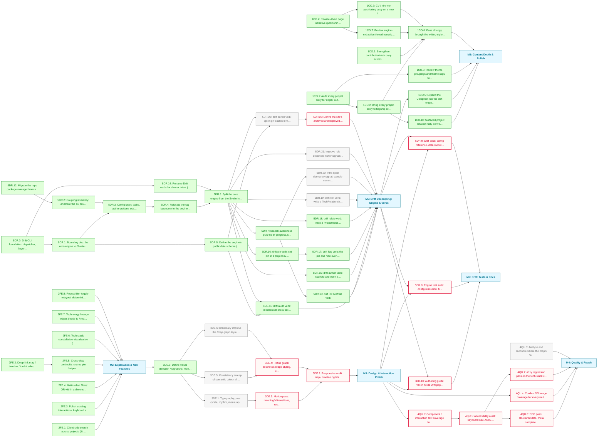

# Portfolio MVP Roadmap

The site is live and substantially built: full routes, the graph/timeline/map/toolkit views, 30+ typed projects and the Drift CLI. This phase deepens the site as an artefact and decouples Drift's engine from its portfolio-specific couplings. Content (M1), features (M2) and the Drift engine work (M5, bar its verb backlog) are done; design (M3), quality (M4) and Drift's tests-and-docs (M6) remain.

**Critical path:** `3DE.0 → 3DE.1 → 3DE.3 → 3DE.2 → M3 → 4QU.5 → 4QU.1 → 4QU.3` — the visual-direction decision unblocks every design task, M3 gates all of M4 and M6, and the accessibility audit chain is the longest quality run.

---

## Milestone 1 — Content Depth & Polish

**Goal:** Make the written substance match the engineering: every entry flagship-ready, the connective copy carrying voice and intent.

- [x] **1CO.1** — Audit every project entry for depth; output in docs/audits/content-depth.md
- [x] **1CO.2** — Bring every project entry to flagship-ready depth (worklist in docs/audits/content-depth.md) _(depends on 1CO.1)_
- [x] **1CO.3** — Strengthen contributionNote copy across all team projects
- [x] **1CO.4** — Rewrite About page narrative (positioning, voice)
- [x] **1CO.5** — Expand the Colophon into the drift-engine deep-dive: the build, the data model and the Drift tooling story _(depends on M5)_
- [x] **1CO.6** — Review theme groupings and theme copy for coherence _(depends on 1CO.1)_
- [x] **1CO.7** — Review engine-extraction thread narratives for clarity _(depends on 1CO.4)_
- [x] **1CO.8** — Pass all copy through the writing-style guide (British spelling, voice) _(depends on 1CO.2, 1CO.3, 1CO.7, 1CO.9)_
- [x] **1CO.9** — CV / hire-me positioning copy on a new /hire route _(depends on 1CO.4)_
- [x] **1CO.10** — Surfaced-project rotation: fully derived hero scoring and map hub selection _(depends on 1CO.2)_

---

## Milestone 2 — Exploration & New Features

**Goal:** Give visitors more ways into the work: search, deep-linkable selections, multi-select filters, polished interactions and a tech-stack constellation.

- [x] **2FE.1** — Client-side search across projects (title, tags, description)
- [x] **2FE.2** — Deep-link map / timeline / toolkit selections via shared URL params
- [x] **2FE.3** — Polish existing interactions: keyboard and ARIA parity, shared dim tokens, cross-view link fixes
- [x] **2FE.4** — Multi-select filters: OR within a dimension, AND across dimensions
- [x] **2FE.5** — Cross-view continuity: shared pin helpers and view-to-view links _(depends on 2FE.2)_
- [x] **2FE.6** — Tech-stack constellation visualisation (technologies mode on the map)
- [x] **2FE.7** — Technology lineage edges (leads-to / replaced-by) on the map and adoption chart
- [x] **2FE.8** — Robust filter-toggle relayout: deterministic best-of-N reheat

---

## Milestone 3 — Design & Interaction Polish

**Goal:** Give the site a distinct visual identity, settling a design direction first so every polish task flows from it.

- [x] **3DE.0** — Define visual direction / signature: mood, type pairing, motion language, graph styling principles
- [ ] **3DE.1** — Typography pass (scale, rhythm, measure) across all routes _(depends on 3DE.0)_
- [ ] **3DE.2** — Responsive audit: map / timeline / grids on small viewports _(blocked — depends on 3DE.3, 3DE.4)_
- [ ] **3DE.3** — Motion pass: meaningful transitions, respect prefers-reduced-motion _(blocked — depends on 3DE.1)_
- [ ] **3DE.4** — Refine graph aesthetics (edge styling, clustering legibility, constellation view) _(blocked — depends on 3DE.5, 3DE.6)_
- [ ] **3DE.5** — Consistency sweep of semantic colour aliases vs Reasonable Colors usage _(depends on 3DE.0)_
- [ ] **3DE.6** — Drastically improve the /map graph layout for legibility _(depends on 3DE.0)_

---

## Milestone 4 — Quality & Reach

**Goal:** Make the site accessible, discoverable and well-tested; the quality bar is itself part of the exhibit.

- [ ] **4QU.1** — Accessibility audit: keyboard nav, ARIA, contrast, SVG view semantics _(blocked — depends on 4QU.5)_
- [ ] **4QU.3** — SEO pass: structured data, meta completeness, sitemap; light perf sanity-check _(blocked — depends on 4QU.1)_
- [ ] **4QU.4** — Confirm OG image coverage for every route and project _(blocked — depends on M3)_
- [ ] **4QU.5** — Component / interaction test coverage for the connection views _(blocked — depends on M3)_
- [ ] **4QU.7** — a11y regression pass on the tech-stack constellation _(blocked — depends on 4QU.1)_
- [ ] **4QU.8** — Analyse and reconcile where the map's Technologies mode and the Toolkit get their data: overlapping tech vocabularies from different sources should agree

---

## Milestone 5 — Drift Decoupling: Engine & Verbs

**Goal:** Break Drift's six portfolio couplings into a config-driven design: a framework-agnostic core engine beside a Svelte integration layer.

- [x] **5DR.0** — Drift CLI foundation: dispatcher, fingerprinting, cache, manifest registry, core verbs
- [x] **5DR.1** — Boundary doc: the core-engine vs Svelte-integration contract _(depends on 5DR.0)_
- [x] **5DR.2** — Coupling inventory: annotate the six couplings in check-drift.js _(depends on 5DR.12)_
- [x] **5DR.3** — Config layer: paths, author pattern, scan root, excludes, gum theme _(depends on 5DR.1, 5DR.2)_
- [x] **5DR.4** — Relocate the tag taxonomy to the engine boundary _(depends on 5DR.3)_
- [x] **5DR.5** — Define the engine's public data schema (the sources.schema.json contract) _(depends on 5DR.1)_
- [x] **5DR.6** — Split the core engine from the Svelte integration _(depends on 5DR.4, 5DR.14)_
- [x] **5DR.7** — Branch awareness plus the in-progress.json staging pipeline _(depends on 5DR.6)_
- [x] **5DR.11** — drift audit verb: mechanical-proxy tier scoring across authored overlays _(depends on 5DR.5, 5DR.6)_
- [x] **5DR.12** — Migrate the repo package manager from npm to Bun
- [x] **5DR.13** — drift init scaffold verb _(depends on 5DR.7)_
- [x] **5DR.14** — Rename Drift verbs for clearer intent (update to sync, accept to keep, exclude to hide) _(depends on 5DR.0)_
- [x] **5DR.15** — drift author verb: scaffold and open a project overlay _(depends on 5DR.6)_
- [x] **5DR.16** — drift pin verb: set pin in a project overlay _(depends on 5DR.6)_
- [x] **5DR.17** — drift flag verb: the pin and hide overlay flags under one verb _(depends on 5DR.16)_
- [x] **5DR.18** — drift relate verb: write a ProjectRelationship into a project overlay
- [ ] **5DR.19** — drift link verb: write a TechRelationship into tech-relationships.ts _(depends on 5DR.6)_
- [ ] **5DR.20** — Intra-span dormancy signal: sample commit dates so activity gaps become detectable _(depends on 5DR.7)_
- [ ] **5DR.21** — Improve role detection: richer signals than commit share for the solo/lead/collaborator inference _(depends on 5DR.6)_
- [ ] **5DR.22** — drift enrich verb: opt-in gh-backed enrichment writing archived and homepageUrl into a schema-extended sources.json section, while drift sync stays offline _(depends on 5DR.5, 5DR.6)_
- [ ] **5DR.23** — Derive the site's archived and deployed axes from enriched manifest data, replacing the authored placeholders _(blocked — depends on 5DR.22)_

---

## Milestone 6 — Drift: Tests & Docs

**Goal:** Once the engine is stable, lock it down with a test suite and document it for future maintainers.

- [ ] **5DR.8** — Engine test suite: config resolution, fingerprinting, drift computation _(blocked — depends on M3, M5)_
- [ ] **5DR.9** — Drift docs: config reference, data model, metric-precedence lifecycle diagram _(blocked — depends on M3, M5)_
- [ ] **5DR.10** — Authoring guide: which fields Drift populates vs hand-authored, and where overrides live _(blocked — depends on M3, M5)_

---

## Dependency Diagram

