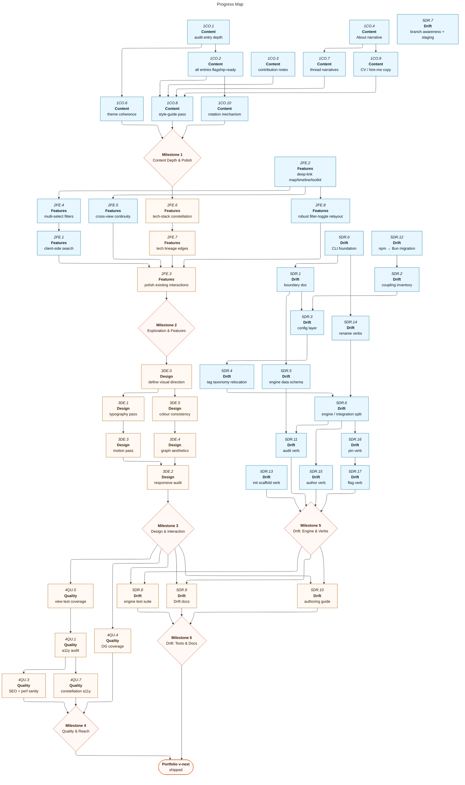

# Portfolio: Forward Roadmap

The site is live and substantially built (full routes, graph/timeline/map/toolkit views, 30+ typed projects, the Drift CLI). This roadmap captures what comes next: deepening the site as an artefact, and decoupling Drift's engine from its portfolio-specific couplings so it could power any frontend.

|              | Status                                                                                                                                                                                                                                                                                                                                       | Next Up                                                              | Blocked                                                                   |
| ------------ | -------------------------------------------------------------------------------------------------------------------------------------------------------------------------------------------------------------------------------------------------------------------------------------------------------------------------------------------- | -------------------------------------------------------------------- | ------------------------------------------------------------------------- |
| **Content**  | 30+ entries, themes, threads, About, CV/hire; depth audit complete; Colophon/drift-engine rebuilt post-M5 (1CO.5); style-guide pass complete (1CO.8) — **Milestone 1 done**                                                                                                                                                                  | Tech constellation (2FE.6) now unblocked                             | _None._                                                                   |
| **Features** | 2FE.1, 2FE.2, 2FE.4, 2FE.5, 2FE.8 done; all connection views built (search, multi-select, cross-view continuity, relayout)                                                                                                                                                                                                                   | Polish pass (2FE.3) after 2FE.7; tech constellation (2FE.6) after M1 | 2FE.6 blocked on M1; 2FE.7 blocked on 2FE.6; 2FE.3 blocked on 2FE.7/2FE.8 |
| **Design**   | Reasonable Colors tokens, dark mode                                                                                                                                                                                                                                                                                                          | Visual direction (3DE.0) after M2                                    | All M3 tasks blocked on M2 completion                                     |
| **Quality**  | Strict types, data-integrity tests, prerendered                                                                                                                                                                                                                                                                                              | Test coverage (4QU.5) and OG coverage (4QU.4) after M3               | All M4 tasks blocked on M3; a11y (4QU.7) blocked on 4QU.1                 |
| **Drift**    | 2.5k-line CLI, manifest registry, cache, verbs, Bun migration, boundary doc, config layer, tag taxonomy (5DR.4), engine schema (5DR.5), engine/integration split (5DR.6), branch awareness + staging pipeline (5DR.7), init scaffold (5DR.13), audit verb (5DR.11), author/pin verbs (5DR.15/5DR.16), `flag` verb (5DR.17) — **M5 complete** | Colophon/drift-engine Drift story (1CO.5) delivered                  | Tests & docs (M6) blocked on M3 + M5                                      |

---

## Contents

- [Milestones](#milestones)
  - [Milestone 1: Content Depth & Polish](#m1)
  - [Milestone 2: Exploration & New Features](#m2)
  - [Milestone 3: Design & Interaction Polish](#m3)
  - [Milestone 4: Quality & Reach](#m4)
  - [Milestone 5: Drift Decoupling — Engine & Verbs](#m5)
  - [Milestone 6: Drift — Tests & Docs](#m6)
- [Progress Map](#map)
- [Links](#links)
- [Beyond MVP](#post-mvp)

---

<a name="milestones"><h2>Milestones</h2></a>

<a name="m1"><h3>Milestone 1: Content Depth & Polish</h3></a>

> [!IMPORTANT]
> **Goal:** Make the written substance match the engineering. Every project entry should be surfaceable as a flagship; which one is foregrounded rotates. The connective copy (About, Colophon, themes, threads) carries voice and intent. There is no tier of "flagship projects" — every entry gets there.

<a name="m1-doing"><h4>In Progress (Milestone 1)</h4></a>

_None._

<a name="m1-todo"><h4>To Do (Milestone 1)</h4></a>

_None._

<a name="m1-blocked"><h4>Blocked (Milestone 1)</h4></a>

_None._

<a name="m1-done"><h4>Completed (Milestone 1)</h4></a>

- [x] 1CO.1. Audit every project entry for depth — which read thin, which read full, what's structurally missing — output in [`docs/audits/content-depth.md`](../audits/content-depth.md)
- [x] 1CO.2. Bring every project entry to flagship-ready depth — worklist in [`docs/audits/content-depth.md`](../audits/content-depth.md). All 7 sub-Full entries resolved (6 rewritten, `kamino` excluded) and an editorial polish pass run across all 27 Full entries.
- [x] 1CO.3. Strengthen `contributionNote` copy across all team projects — structured `collaboration` field (team/employer/client) on all contributions; role-aware field-merge; rewritten notes across 11 overlays; colophon snippet updated; data test guards the invariant.
- [x] 1CO.4. Rewrite About page narrative (positioning, voice) — leading with stance ("What I build") not autobiography; positioning lede under h1; four credibility specifics retained; h2 scale corrected; GitHub links via constants.
- [x] 1CO.6. Review theme groupings and theme copy for coherence — three blurbs corrected, `commons-traybake` removed from `graph-native`, `schema-forge` added to `terminal-native`, new `human-history` territory added (`historia`, `epoch`, `those-who-came-before`), toolkit count made dynamic.
- [x] 1CO.7. Review engine-extraction thread narratives for clarity — rewrote all six relationship notes (3 `powers` + 3 `extracted-from`) to carry the extraction insight rather than restate card labels; standardised `extracted-from` notes to consistent "lifted out of … into the standalone … library" shape; light strapline tightening in `EngineThread.svelte`.
- [x] 1CO.9. CV / hire-me positioning copy — new `/hire` route with capabilities, three engagement shapes, and contact CTA; hamburger nav on narrow screens; `EMAIL` lifted into config.
- [x] 1CO.10. Surfaced-project rotation / curation mechanism — fully derived: home hero scores by active-substance (recency × log-substance, 30-day half-life); no manual flagship flags; deal-another control cycles the full eligible pool; map hub set derived from p85 substance percentile (node size AND label visibility).
- [x] 1CO.8. Pass all copy through the writing-style guide (British spelling, no em-dashes, voice) — full voice pass across About, hire, drift-engine, 33 project overlays, theme blurbs, contribution notes, page intros, SEO descriptions and root bio; calibration log documented in skill file; kamino excluded via `drift flag --hide`.
- [x] 1CO.5. Expand Colophon: explain the build, the data model, and headline the Drift tooling story — re-done after M5 as required: route renamed `colophon` → `drift-engine`; full editorial rewrite as an engineer-facing builder deep-dive; new headlined Drift section reflecting the decoupled engine/integration architecture; accordion replaced with a scrollytelling layout; app/gallery page redesign; build-time Shiki syntax highlighting (Vitesse light/dark, zero client JS); corrected `ProjectSlug` and `contributionNote` snippets.

---

<a name="m2"><h3>Milestone 2: Exploration & New Features</h3></a>

> [!IMPORTANT]
> **Goal:** Give visitors more ways into the work. The map is already rich; the real gaps are search (genuinely absent), deep-linkable selections on the non-projects views, multi-select filters, polishing the static interactions, and one new visualisation angle: a tech-stack constellation.

<a name="m2-doing"><h4>In Progress (Milestone 2)</h4></a>

_None._

<a name="m2-todo"><h4>To Do (Milestone 2)</h4></a>

_None._

<a name="m2-blocked"><h4>Blocked (Milestone 2)</h4></a>

- [ ] 2FE.3. Polish existing interactions — final integration pass covering all new interactions — **re-do once 2FE.7/2FE.8 are complete** — **depends on 2FE.7, 2FE.8**. _Previously completed: `AdoptionTimeline` hover/focus highlight with animated dot-scale, dim-others behaviour, and date-honesty distinction; TimelineChart pointer events for touch parity, per-node `<title>`, and `prefers-reduced-motion` guard._
- [ ] 2FE.6. Tech-stack constellation visualisation — a `ProjectMap` variant clustering projects by shared stack; islands = niche tech, dense core = default toolkit — **depends on m1**
- [ ] 2FE.7. Technology lineage edges — hand-authored `leads-to` / `replaced-by` relationships between technologies, rendered as directed edges on the adoption chart or constellation; modelled on `ProjectRelationship`. Requires a new `TechRelationship { kind: 'leads-to' | 'replaced-by'; source: label; target: label; note?: string }` structure and hand-authored edge data — **depends on 2FE.6**

<a name="m2-done"><h4>Completed (Milestone 2)</h4></a>

- [x] 2FE.1. Client-side search across projects (title, tags, description) — `filterProjects` extended with a `query` field; case-insensitive substring match across name, tagline, blurb, description, and tag labels; `SearchInput` component with debounced input; `?q=` URL param wired into `FilterBar`; full query test coverage in `queries.test.ts`.
- [x] 2FE.2. Deep-link map / timeline / toolkit selections — clicking an item opens a `SelectionModal` (built on native `<dialog>`) offering Pin (writes the URL param, persists the highlight) or Go to project; the underlying `<a href>` stays the no-JS fallback. Shared `?project=` across map/timeline/themes (cross-view continuity substrate for 2FE.5); `?tech=` on the adoption chart with a tested `encodeTechLabel`/`decodeTechLabel` codec (handles `C#`, `.NET 8`). Extracted a shared `writeParam` (`src/lib/url-write.ts`) and deduped the projects-page `setParam` and ProjectMap's local copy onto it. Stale-pin and filter-hidden guards prevent a dead link dimming a whole view.
- [x] 2FE.4. Multi-select filters — each dimension (role, type, status, tag) accumulates a set of selections: OR within a dimension, AND across dimensions. URL params pluralised (`roles`/`types`/`statuses`/`tags`); per-token percent-encoding for `C#`, `.NET 8` etc.; `FilterBar` widened to `Set<T>`; full test coverage.
- [x] 2FE.5. Cross-view continuity — shared `validatePin`/`nextPinValue` helpers extracted into `src/lib/selection.ts`; all three connection views (`ProjectMap`, `TimelineChart`, `ThemeTerritories`) use them; project detail page gains "View in map / timeline / toolkit" links carrying `?project=`; modal "Go to project" links route via `projectHref`; `RelatedProjects` neighbour links via `projectHref`.
- [x] 2FE.8. Robust filter-toggle relayout — `computeRelayoutTargets` exported from `graph.ts`: deterministic reduced best-of-N (5 seeds × 220 ticks) over the visible subgraph, crossing-minimised. `ProjectMap` reheat debounced (120ms) and seeded from the lowest-crossing topology before the live d3 simulation relaxes. `FORCE_TUNING` and `countCrossings` exported for tests.

---

<a name="m3"><h3>Milestone 3: Design & Interaction Polish</h3></a>

> [!IMPORTANT]
> **Goal:** Give the site a distinct visual identity — it currently reads a bit default/templated. Settle a design direction first; every other polish task (typography, motion, graph aesthetics, colour) should flow from that decision rather than precede it. Responsive audit is structural and can proceed independently.

<a name="m3-doing"><h4>In Progress (Milestone 3)</h4></a>

_None._

<a name="m3-todo"><h4>To Do (Milestone 3)</h4></a>

_None._

<a name="m3-blocked"><h4>Blocked (Milestone 3)</h4></a>

- [ ] 3DE.0. Define visual direction / signature — mood, type pairing, motion language, graph styling principles; the foundation everything else depends on — **depends on m2**
- [ ] 3DE.1. Typography pass (scale, rhythm, measure) across all routes — **depends on 3DE.0**
- [ ] 3DE.3. Motion pass: meaningful transitions, respect `prefers-reduced-motion` — **depends on 3DE.1**
- [ ] 3DE.4. Refine graph aesthetics (edge styling, clustering legibility, constellation view) — **depends on 3DE.5**
- [ ] 3DE.5. Consistency sweep of semantic colour aliases vs Reasonable Colors usage — **depends on 3DE.0**
- [ ] 3DE.2. Responsive audit: map / timeline / grids on small viewports — **depends on 3DE.3, 3DE.4**

<a name="m3-done"><h4>Completed (Milestone 3)</h4></a>

_None yet._

---

<a name="m4"><h3>Milestone 4: Quality & Reach</h3></a>

> [!IMPORTANT]
> **Goal:** Make the site accessible, discoverable, and well-tested. The quality bar is itself part of the exhibit. Analytics deliberately excluded — tracker-free is a statement. Performance is already strong (fully prerendered, no-JS baseline) so it folds into the SEO pass rather than standing alone.

<a name="m4-doing"><h4>In Progress (Milestone 4)</h4></a>

_None._

<a name="m4-todo"><h4>To Do (Milestone 4)</h4></a>

_None._

<a name="m4-blocked"><h4>Blocked (Milestone 4)</h4></a>

- [ ] 4QU.5. Component / interaction test coverage for the connection views (beyond existing data-integrity tests) — **depends on m3**
- [ ] 4QU.4. Confirm OG image coverage for every route and project — **depends on m3**
- [ ] 4QU.1. Accessibility audit: keyboard nav, ARIA, contrast, SVG view semantics (the interactive graphs especially) — **depends on 4QU.5**
- [ ] 4QU.3. SEO pass: structured data, meta completeness, sitemap verification; includes a light perf sanity-check (bundle size, hydration cost) — **depends on 4QU.1**
- [ ] 4QU.7. a11y regression pass on the tech-stack constellation — **depends on 4QU.1**

<a name="m4-done"><h4>Completed (Milestone 4)</h4></a>

_None yet._

---

<a name="m5"><h3>Milestone 5: Drift Decoupling — Engine & Verbs</h3></a>

> [!IMPORTANT]
> **Goal:** Break Drift's 6 hard-coded portfolio couplings into a config-driven design, producing a clean internal boundary: a framework-agnostic core engine (emits typed/JSON data) alongside a Svelte integration layer. Stays in this repo — packaging and distribution is Beyond MVP. The unbuilt in-repo backlog (branch awareness, `in-progress.json` staging pipeline, new verbs) gets built correctly inside this decoupled design rather than separately. Test suites and developer docs land in Milestone 6 once the engine is stable.

The 6 couplings to resolve (all in `scripts/check-drift.js`):

- Hard-coded path constants (lines 34–41: sources, overrides, excluded, cache, projects) → config
- `~/Code` scan root (line 862) + seeded `excluded.json.repoNames` → config
- `AUTHOR_PATTERN` (line 103) → config
- `.ts` regex-scraping of `projects/<slug>.ts` (`curatedLanguages`/`curatedStatus`) → Svelte integration layer
- gum brand colours `#3E7F96` / `#B34480` (lines 1244, 2099–2117) → config/theme
- `tag-taxonomy.js` lives under `src/lib/data` → relocate to engine boundary

<a name="m5-doing"><h4>In Progress (Milestone 5)</h4></a>

_None._

<a name="m5-todo"><h4>To Do (Milestone 5)</h4></a>

_None._

<a name="m5-blocked"><h4>Blocked (Milestone 5)</h4></a>

_None._

<a name="m5-done"><h4>Completed (Milestone 5)</h4></a>

- [x] 5DR.17. `drift flag <slug> --pin | --hide` verb: set `pin: true` or `hide: true` in the slug's `.ts` overlay (creating the overlay if needed) — hard cut replacing `drift pin`; `flag` exposes both overlay-level curation flags under one verb, sidestepping the naming collision with the engine-level `drift hide` (which writes `excluded.json.slugs`); `setOverlayFlag(slug, flagName, palette)` is the shared core extracted from `runPin`; mutual-exclusivity guard; idempotent; 14 new tests; `BREAKING CHANGE: drift pin <slug>` replaced by `drift flag <slug> --pin`. Depends on 5DR.16.
- [x] 5DR.16. `drift pin <slug>` verb: set `pin: true` in the slug's `.ts` overlay (creating the overlay if needed); TypeScript compiler API text-splice — never touches the four JSON data files. Overlay templates use the same `createOverlayIfAbsent` helper as 5DR.15. Idempotent. Depends on 5DR.6.
- [x] 5DR.15. `drift author <slug>` verb: scaffolds `src/lib/data/projects/<slug>.ts` from a full commented template if absent, then opens it in `$EDITOR`; slug-to-camelCase binding; full rubric-hint comments; never overwrites. Depends on 5DR.6.
- [x] 5DR.11. `drift audit` verb: mechanical-proxy tier scoring (Full/Partial/Thin) across all authored overlays via per-file dynamic `import()`; thresholds from the content-depth rubric (desc words, highlight count, team contributionNote); worst-axis rule; borderline flagging; gum-format markdown + ANSI fallback + `--json` mode; 26 new tests. Recomputes from live files; never consults the stale committed scorecard. Boundary doc updated to document the sanctioned overlay read. Depends on 5DR.5, 5DR.6.
- [x] 5DR.13. `drift init` scaffold verb: generates `src/lib/data/sources.local.json` (empty `paths`) and `drift.config.ts` (populated from DEFAULTS); interactive gum prompts for scan root, author pattern, theme colours, scan depth, and excludes when a TTY is present; non-interactive fallback writes real defaults silently; never overwrites existing files. Replaces the broken `cp sources.local.json.example` instruction. Depends on 5DR.7.
- [x] 5DR.7. Branch awareness + `in-progress.json` staging pipeline: fingerprint engine now resolves and measures against each repo's default branch (`origin/HEAD` to `main` to `master` to `HEAD` fallback); `measuredRef` recorded as metadata (excluded from drift comparison via `DRIFT_SKIP_FIELDS`); `git cat-file --batch` streaming for ref-aware LOC/language counting; `in-progress.json` committed data file (sibling to `sources.json`) with schema + `InProgressEntry`/`TrackedField` types; `drift promote` verb graduates in-progress entries; provisional values surface on the site at `override > synced > provisional > authored` precedence; graduation detection via `git merge-base --is-ancestor`; HEAD-fallback + in-progress advisory sections in the drift report; full test suite (schema, precedence, promote write-isolation, DRIFT_SKIP_FIELDS structural contract). Depends on 5DR.6; unblocks 5DR.13.
- [x] 5DR.0. Drift CLI foundation: subcommand dispatcher, async fingerprinting + cache, manifest-driven registry, shared tag taxonomy, gum interactive UX, `snapshot` / `report` / `hide` verbs (shipped in-repo; see `docs/drift-improvement-plan.md`)
- [x] 5DR.12. Migrate repo package manager from npm to Bun: switch lockfile (`bun install`, delete `package-lock.json`), update the four drift scripts in `package.json` from `node scripts/check-drift.js` to `bun run`, confirm Vite/Vitest/svelte-check all run under Bun — the portfolio should dogfood the preferred toolkit, and a Bun-native runtime is a prerequisite for packaging Drift as a distributable CLI
- [x] 5DR.14. Rename Drift verbs so they signpost intent more clearly (`update`→`sync`, `accept`→`keep`, `accept-all`→`keep-all`, `exclude`→`hide`); updates `KNOWN_VERBS`, both dispatch switches, both help objects, menu rows, `package.json` scripts, data-file notes, hook example, and docs. Hard cut — no aliases. Breaking change to the CLI surface — gates the engine split (5DR.6) and all new verbs — **depends on 5DR.0**
- [x] 5DR.6. Split core engine from Svelte integration: deleted `curatedLanguages`, `ungatedLanguages`, `curatedStatus` from the engine (Route B — engine drops the overlay dependency entirely); removed `ungated` and `statusHint` advisory hints from the report; correctness gate remains as CI test in `data.test.ts`; `statusHint` retired (no site-side analogue). Engine now reads/writes only the four data files. Boundary doc updated. — **depends on 5DR.4, 5DR.14**
- [x] 5DR.5. Define engine's public data schema (the typed/JSON output contract): moved `sources.schema.json` to `scripts/sources.schema.json`; engine validates every `SyncedSource` record against it before writing; `FINGERPRINT_FIELDS` derived from schema; `sources.schema.test.ts` guards the contract — **depends on 5DR.1**
- [x] 5DR.4. Relocate tag taxonomy to the engine boundary: moved `tag-taxonomy.js` (all five maps) from `src/lib/data/` to `scripts/tag-taxonomy.js` alongside the engine; engine import localised to `./tag-taxonomy.js`; integration layer (`defaults.ts`) repointed to `../../../scripts/tag-taxonomy.js`; coupling comment updated; boundary doc and roadmap updated — **depends on 5DR.3**
- [x] 5DR.3. Config layer: paths, author pattern, scan root, excludes, gum theme all become user-config — `scripts/drift-config.js` owns built-in defaults and best-effort loader; `drift.config.ts` (gitignored) provides per-machine overrides; `repoNames` moved to config (paired to `scanRoot`); `excluded.json` trimmed to `slugs`-only — **depends on 5DR.1, 5DR.2**
- [x] 5DR.2. Coupling inventory: annotate the 6 couplings in `scripts/check-drift.js` with `// COUPLING [5DR.N]:` markers + resolver task. Extracted gum brand colours (`#3E7F96`/`#B34480`) to `BRAND_PRIMARY`/`BRAND_ACCENT` constants, collapsing 14 literals to 2. No behaviour change — **depends on 5DR.12**
- [x] 5DR.1. Boundary doc: define the core-engine vs Svelte-integration contract (what each layer owns) — **depends on 5DR.0**

---

<a name="m6"><h3>Milestone 6: Drift — Tests & Docs</h3></a>

> [!IMPORTANT]
> **Goal:** Once the engine is stable (M5 complete), lock it down with a test suite and document it for future maintainers. A tested, documented engine is a shippable one.

<a name="m6-doing"><h4>In Progress (Milestone 6)</h4></a>

_None._

<a name="m6-todo"><h4>To Do (Milestone 6)</h4></a>

_None._

<a name="m6-blocked"><h4>Blocked (Milestone 6)</h4></a>

- [ ] 5DR.8. Engine test suite: config resolution, fingerprinting, drift computation — **depends on m3, m5**
- [ ] 5DR.9. Drift docs: config reference, data model, metric-precedence lifecycle diagram — **depends on m3, m5**
- [ ] 5DR.10. Authoring guide: document which fields Drift populates automatically vs which require / accept hand-authored values, and where override files live — a short dev-facing reference so the authoring workflow is unambiguous — **depends on m3, m5**

<a name="m6-done"><h4>Completed (Milestone 6)</h4></a>

_None yet._

---

<a name="map"><h2>Progress Map</h2></a>

---

<a name="links"><h2>Links</h2></a>

- Live site: [jason-warren.vercel.app](https://jason-warren.vercel.app)
- Drift build history & decisions: [`docs/drift-improvement-plan.md`](../drift-improvement-plan.md)
- Data model: [`src/lib/data/types.ts`](../../src/lib/data/types.ts)
- Tag taxonomy: [`src/lib/data/tag-taxonomy.js`](../../src/lib/data/tag-taxonomy.js)
- House style: [`CLAUDE.md`](../../CLAUDE.md)

---

<a name="post-mvp"><h2>Beyond MVP</h2></a>

Ideas parked until the milestones above settle:

- **Drift distribution:** package the CLI (`bin` entry, npm/bun distributable), `drift init` scaffold, dogfood this portfolio onto the published package, publish/release to a registry
- Drift as a hosted service (point it at a GitHub org, get a portfolio)
- RSS / now-page / writing surface on the site
- Interactive playground embeds for the toy/game projects
- Internationalised copy
- Generative OG variants per theme
