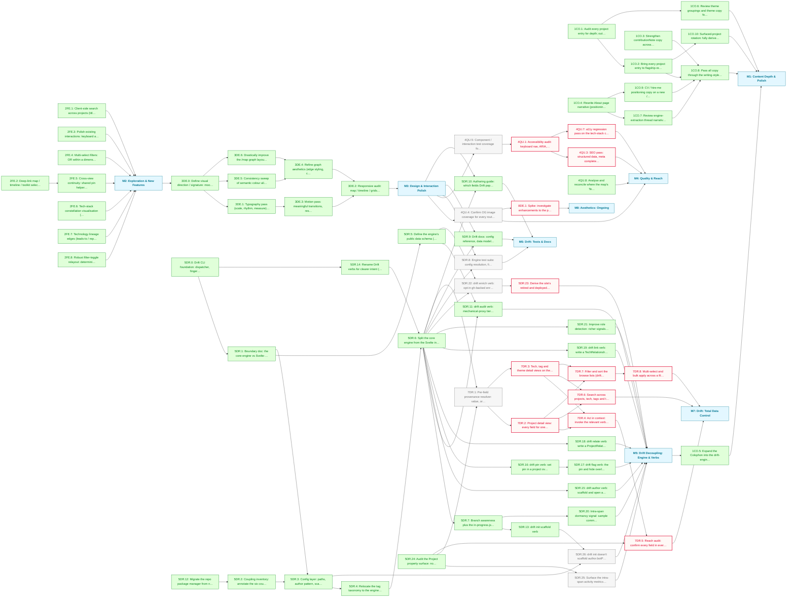

# Portfolio MVP Roadmap

The site is live and substantially built: full routes, the graph/timeline/map/toolkit views, 30+ typed projects and the Drift CLI. This phase deepens the site as an artefact and decouples Drift's engine from its portfolio-specific couplings. Content (M1), features (M2) and design (M3) are done, and the Drift engine work (M5) is complete bar its enrichment verbs and surfacing the intra-span activity metrics; quality (M4), Drift's tests-and-docs (M6), total data control from the CLI menu (M7) and ongoing aesthetics (M8) remain.

**Critical path:** `4QU.5 → 4QU.1 → 4QU.3` — with M3 complete, the accessibility audit chain is the longest remaining run, and 4QU.5 is the one task gating it. M6 and M7 both wait on M5 rather than on design, so they run in parallel with each other and with M4.

---

## Milestone 1 — Content Depth & Polish

**Goal:** Make the written substance match the engineering: every entry flagship-ready, the connective copy carrying voice and intent.

- [x] **1CO.1** — Audit every project entry for depth; output in docs/audits/content-depth.md
- [x] **1CO.2** — Bring every project entry to flagship-ready depth (worklist in docs/audits/content-depth.md) _(depends on 1CO.1)_
- [x] **1CO.3** — Strengthen contributionNote copy across all team projects
- [x] **1CO.4** — Rewrite About page narrative (positioning, voice)
- [x] **1CO.5** — Expand the Colophon into the drift-engine deep-dive: the build, the data model and the Drift tooling story _(depends on M5)_
- [x] **1CO.6** — Review theme groupings and theme copy for coherence _(depends on 1CO.1)_
- [x] **1CO.7** — Review engine-extraction thread narratives for clarity _(depends on 1CO.4)_
- [x] **1CO.8** — Pass all copy through the writing-style guide (British spelling, voice) _(depends on 1CO.2, 1CO.3, 1CO.7, 1CO.9)_
- [x] **1CO.9** — CV / hire-me positioning copy on a new /hire route _(depends on 1CO.4)_
- [x] **1CO.10** — Surfaced-project rotation: fully derived hero scoring and map hub selection _(depends on 1CO.2)_

---

## Milestone 2 — Exploration & New Features

**Goal:** Give visitors more ways into the work: search, deep-linkable selections, multi-select filters, polished interactions and a tech-stack constellation.

- [x] **2FE.1** — Client-side search across projects (title, tags, description)
- [x] **2FE.2** — Deep-link map / timeline / toolkit selections via shared URL params
- [x] **2FE.3** — Polish existing interactions: keyboard and ARIA parity, shared dim tokens, cross-view link fixes
- [x] **2FE.4** — Multi-select filters: OR within a dimension, AND across dimensions
- [x] **2FE.5** — Cross-view continuity: shared pin helpers and view-to-view links _(depends on 2FE.2)_
- [x] **2FE.6** — Tech-stack constellation visualisation (technologies mode on the map)
- [x] **2FE.7** — Technology lineage edges (leads-to / replaced-by) on the map and adoption chart
- [x] **2FE.8** — Robust filter-toggle relayout: deterministic best-of-N reheat

---

## Milestone 3 — Design & Interaction Polish

**Goal:** Give the site a distinct visual identity, settling a design direction first so every polish task flows from it.

- [x] **3DE.0** — Define visual direction / signature: mood, type pairing, motion language, graph styling principles
- [x] **3DE.1** — Typography pass (scale, rhythm, measure) across all routes _(depends on 3DE.0)_
- [x] **3DE.2** — Responsive audit: map / timeline / grids on small viewports _(depends on 3DE.3, 3DE.4)_
- [x] **3DE.3** — Motion pass: meaningful transitions, respect prefers-reduced-motion _(depends on 3DE.1)_
- [x] **3DE.4** — Refine graph aesthetics (edge styling, clustering legibility, constellation view) _(depends on 3DE.5, 3DE.6)_
- [x] **3DE.5** — Consistency sweep of semantic colour aliases vs Reasonable Colors usage _(depends on 3DE.0)_
- [x] **3DE.6** — Drastically improve the /map graph layout for legibility _(depends on 3DE.0)_

---

## Milestone 4 — Quality & Reach

**Goal:** Make the site accessible, discoverable and well-tested; the quality bar is itself part of the exhibit.

- [ ] **4QU.1** — Accessibility audit: keyboard nav, ARIA, contrast, SVG view semantics _(blocked — depends on 4QU.5)_
- [ ] **4QU.3** — SEO pass: structured data, meta completeness, sitemap; light perf sanity-check _(blocked — depends on 4QU.1)_
- [ ] **4QU.4** — Confirm OG image coverage for every route and project _(depends on M3)_
- [ ] **4QU.5** — Component / interaction test coverage for the connection views _(depends on M3)_
- [ ] **4QU.7** — a11y regression pass on the tech-stack constellation _(blocked — depends on 4QU.1)_
- [x] **4QU.8** — Analyse and reconcile where the map's Technologies mode and the Toolkit get their data: overlapping tech vocabularies from different sources should agree

---

## Milestone 5 — Drift Decoupling: Engine & Verbs

**Goal:** Break Drift's six portfolio couplings into a config-driven design: a framework-agnostic core engine beside a Svelte integration layer.

- [x] **5DR.0** — Drift CLI foundation: dispatcher, fingerprinting, cache, manifest registry, core verbs
- [x] **5DR.1** — Boundary doc: the core-engine vs Svelte-integration contract _(depends on 5DR.0)_
- [x] **5DR.2** — Coupling inventory: annotate the six couplings in check-drift.js _(depends on 5DR.12)_
- [x] **5DR.3** — Config layer: paths, author pattern, scan root, excludes, gum theme _(depends on 5DR.1, 5DR.2)_
- [x] **5DR.4** — Relocate the tag taxonomy to the engine boundary _(depends on 5DR.3)_
- [x] **5DR.5** — Define the engine's public data schema (the sources.schema.json contract) _(depends on 5DR.1)_
- [x] **5DR.6** — Split the core engine from the Svelte integration _(depends on 5DR.4, 5DR.14)_
- [x] **5DR.7** — Branch awareness plus the in-progress.json staging pipeline _(depends on 5DR.6)_
- [x] **5DR.11** — drift audit verb: mechanical-proxy tier scoring across authored overlays _(depends on 5DR.5, 5DR.6)_
- [x] **5DR.12** — Migrate the repo package manager from npm to Bun
- [x] **5DR.13** — drift init scaffold verb _(depends on 5DR.7)_
- [x] **5DR.14** — Rename Drift verbs for clearer intent (update to sync, accept to keep, exclude to hide) _(depends on 5DR.0)_
- [x] **5DR.15** — drift author verb: scaffold and open a project overlay _(depends on 5DR.6)_
- [x] **5DR.16** — drift pin verb: set pin in a project overlay _(depends on 5DR.6)_
- [x] **5DR.17** — drift flag verb: the pin and hide overlay flags under one verb _(depends on 5DR.16)_
- [x] **5DR.18** — drift relate verb: write a ProjectRelationship into a project overlay
- [x] **5DR.19** — drift link verb: write a TechRelationship into tech-relationships.ts _(depends on 5DR.6)_
- [x] **5DR.20** — Intra-span dormancy signal: sample commit dates so activity gaps become detectable _(depends on 5DR.7)_
- [x] **5DR.21** — Improve role detection: richer signals than commit share for the solo/lead/collaborator inference _(depends on 5DR.6)_
- [ ] **5DR.22** — drift enrich verb: opt-in gh-backed enrichment writing GitHub's own archived repo flag and homepageUrl into a schema-extended sources.json section, while drift sync stays offline _(depends on 5DR.5, 5DR.6)_
- [ ] **5DR.23** — Derive the site's retired and deployed axes from enriched manifest data, replacing the authored placeholders _(blocked — depends on 5DR.22)_
- [x] **5DR.24** — Audit the Project property surface: no two fields claim the same fact, and every fact worth storing has exactly one home
- [ ] **5DR.25** — Surface the intra-span activity metrics (spanMonthsActive, spanMonthsAll, spanGapMaxDays) so the sustained-vs-bursty signal reaches the site _(depends on 5DR.24)_
  - Note: Covers SyncedSource, AuthoredProject, Project, ProjectMetrics and the nested Contribution/TechTag/ProjectRelationship shapes. Overlap precedent: deployed is derived from liveUrl presence; progress and released were split because one field made two claims; retired and hide both carried the hero-pool exclusion. Coverage gap already known: activeMonths, spanMonths and maxGapDays are synced but reach no Project field.
- [ ] **5DR.26** — drift init doesn't scaffold author.botPattern, so a fresh config silently inherits Jason's personal AI-agent bot pattern as the default _(depends on 5DR.3, 5DR.13)_
  - Note: buildDriftConfigSource (scripts/check-drift.js) scaffolds author.pattern and author.recentWindow but never author.botPattern. A fresh drift.config.ts therefore silently inherits DEFAULTS.author.botPattern from scripts/drift-config.js, which hardcodes Jason's own bot/AI-agent identity pattern (includes noreply@anthropic.com) as the default for excluding non-human commits from the all-authors count. Correct for Jason's own machines; wrong default for anyone else running drift init without realising the field exists to override. Needs a design decision before a fix: what a fresh botPattern should default to (empty string, a generic bot-only pattern with no AI-agent-specific entries, or the current default scaffolded with a comment flagging it as Jason-specific). Found and documented (not fixed) during 5DR.9.

---

## Milestone 6 — Drift: Tests & Docs

**Goal:** Once the engine is stable, lock it down with a test suite and document it for future maintainers.

- [ ] **5DR.8** — Engine test suite: config resolution, fingerprinting, drift computation _(depends on M3, 5DR.6)_
- [x] **5DR.9** — Drift docs: config reference, data model, metric-precedence lifecycle diagram
- [x] **5DR.10** — Authoring guide: which fields Drift populates vs hand-authored, and where overrides live

---

## Milestone 7 — Drift: Total Data Control

**Goal:** A drift portfolio's entire data state can be seen, controlled and manipulated through the drift CLI menu.

- [ ] **7DR.1** — Per-field provenance resolver: value, origin (synced / inferred / authored / overridden), and the inference an authored value agrees or disagrees with _(depends on 5DR.6, 5DR.24)_
  - Note: Provenance is currently spread across sources.json, overrides.json, the project overlay and defaults.ts. One resolver so the detail views and the existing redundancy tests read the same answer.
- [ ] **7DR.2** — Project detail view: every field for one project on a single screen, each with its provenance _(blocked — depends on 7DR.1)_
- [ ] **7DR.3** — Tech, tag and theme detail views on the same pattern as the project view _(blocked — depends on 7DR.1)_
- [ ] **7DR.4** — Act in context: invoke the relevant verbs from a detail view without re-picking the target _(blocked — depends on 7DR.2, 7DR.3)_
  - Note: The menu is verb-first (pick a verb, then a target). This inverts it for the browse path; the verb-first sections stay for anyone who already knows what they want.
- [ ] **7DR.5** — Reach audit: confirm every field in every data file has a menu path, and fill the gaps _(blocked — depends on 5DR.24, 7DR.4)_
  - Note: Only meaningful once 5DR.24 has settled the field set and 7DR.4's detail-view menu paths exist to audit. Covers all eight configured data paths: sources, topology, local, overrides, excluded, cache, projects, in-progress.
- [ ] **7DR.6** — Search across projects, tech, tags and themes from one entry point _(blocked — depends on 7DR.2, 7DR.3)_
- [ ] **7DR.7** — Filter and sort the browse lists (drift state, track, role, tier, kind) _(blocked — depends on 7DR.2, 7DR.3)_
- [ ] **7DR.8** — Multi-select and bulk apply across a filtered set _(blocked — depends on 7DR.7)_
  - Note: Bulk writes are how redundant authored values get mass-produced, which the data.test.ts redundancy checks reject. A bulk write must surface which targets would gain a value matching the inference before it applies.

---

## Milestone 8 — Aesthetics: Ongoing

**Goal:** The standing home for aesthetic work after the visual direction settled in M3: refinements to how the site and its generated artefacts look, taken up once the functional milestones they depend on have landed.

- [ ] **8DE.1** — Spike: investigate enhancements to the procedural OG card generation, and record the options with a recommendation _(blocked — depends on 4QU.4)_
  - Note: Supersedes the parked "Generative OG variants per theme" idea, which was one avenue among several. src/lib/og/card.ts derives each card from project data, but keys its motif on runtime alone via runtimeArchetype(), so 23 of 33 projects collapse into two archetypes (bun 12, node 11) and 5 fall through to the generic dot. Avenues to weigh: widening the archetype signal beyond runtime; theme-driven variants (themes currently feed nothing in card.ts); using signal the card already receives and ignores (kind, track, role, tags, lineage); and the motif mechanics themselves (one fixed 132px tiling, hash-seeded rotation and phase). Output is a written comparison with a recommendation, not an implementation; follow-up tasks land after it is read.

---

## Dependency Diagram

